# Preface

Everything this standard describes is about one thing: evidence of what the agent actually did — the execution record of its actions and their effects — in a form others can check.

AI is moving from systems that answer to agents that act with intent on our behalf. Every boundary an agent crosses — into a database, another company's system, a payment rail, a medical record — is a boundary where evidence of what it did goes missing. The **Verifiability Gap** is that absence of evidence, and it is the problem this standard exists to close. An agent reporting that it stayed in bounds is not evidence that it did, and today no auditor, insurer, or customer can independently verify the difference.

**Proof-of-Control** is open verification that the controls governing an agent system are implemented and hold, graded on four Verifiability Tiers by how independently that can be verified. For each control it claims, across six domains, a conformant implementation MUST produce evidence — generated by the enforcing mechanism at execution time — that the control held; place that evidence on the Verifiability Tiers; and disclose its residual trust assumptions. A system has Proof-of-Control when, and only when, its evidence reaches Tier 3 or Tier 4.

## How This Standard Is Organized

```mermaid
flowchart TB
    subgraph SPEC["📐 The Standard — normative, 0.1/en/"]
        direction TB
        DOM["C1&#8211;C6 The six domains<br/>🧬 Provenance &#183; 🔐 Privacy &#183; 🌉 Portability<br/>🎫 Authorization &#183; 🪪 Identity &#183; 🛡️ Security"]
        CROSS["C7&#8211;C10 Cross-cutting<br/>🧾 Evidence &#183; 🪜 Tiers &#183; 🏗️ System surface &#183; ✅ Conformance"]
        APP["Appendices<br/>📖 A Glossary &#183; 🧰 B Mechanisms &#183; ⚔️ C Threat model &#183; ⚠️ D Open issues"]
        DOM --> CROSS --> APP
    end
    subgraph CASE["📚 The Case — informative, docs/"]
        COMP["Introduction &#183; Why verification matters<br/>Standards landscape &#183; Use cases<br/>Roadmap &#183; Governance &#183; Reviews"]
    end
    subgraph XWALK["🧩 Crosswalks — mappings/"]
        MAP["MAESTRO &#183; AARM &#183; OWASP &#183; ATLAS &#183; NIST<br/>ISO 42001 &#183; SOC 2 &#183; EU AI Act &#183; &#8230;"]
    end
    SPEC -.explained by.-> CASE
    SPEC -.aligned via.-> XWALK
```

**The requirement chapters (C1–C10) are normative.** Requirements language follows RFC 2119 and RFC 8174; each requirement is a testable **"Verify that"** statement with a level (see [Using Proof-of-Control](0x03-Using-Proof-of-Control.md) for the levels).

* **C1–C6 — the six domains of verification:** [Provenance](0x10-C01-Provenance.md), [Privacy](0x10-C02-Privacy.md), [Portability](0x10-C03-Portability.md), [Authorization](0x10-C04-Authorization.md), [Identity](0x10-C05-Identity.md), [Security](0x10-C06-Security.md). What must be verified: each domain enumerates its verifiable facts. An implementation may claim a subset of domains.
* **C7 — [Evidence Generation and Properties](0x10-C07-Evidence-Generation-and-Properties.md):** what a piece of evidence must be to count — generated at the action boundary; binary, contemporaneous, tamper-evident, transparent; bounded by the determinism boundary.
* **C8 — [Verifiability Tiers and the Binary Threshold](0x10-C08-Verifiability-Tiers.md):** how independently the evidence can be verified, and the yes-or-no line that makes the category procurable.
* **C9 — [System Surface (MAESTRO)](0x10-C09-System-Surface-MAESTRO.md):** where in the agent stack the evidence applies.
* **C10 — [Conformance and Trust-Assumption Disclosure](0x10-C10-Conformance-and-Disclosure.md):** how thoroughly the claim was checked, and what must still be trusted.

**The appendices** carry the normative [Glossary](0x90-Appendix-A_Glossary.md) (Appendix A) and [Threat Model](0x92-Appendix-C_Threat-Model.md) (Appendix C), the informative [Proof-Mechanism Inventory](0x91-Appendix-B_Proof-Mechanism-Inventory.md) (Appendix B), and the [Open Working-Group Issues](0x93-Appendix-D_Open-Issues.md) (Appendix D).

**The case for the standard is in the companion documents** ([`docs/`](../../docs)): the [introduction and design principles](../../docs/introduction.md), [why verification matters](../../docs/why-verification-matters.md), the [standards landscape](../../docs/standards-landscape.md), [use cases](../../docs/use-cases.md), the [adoption roadmap](../../docs/roadmap.md), and [governance](../../docs/governance.md). They explain and motivate the standard; they add no requirements. Per-framework crosswalks live in [`mappings/`](../../mappings/README.md).

## Three Graded Axes

The standard grades three different things, and each has its own word — an unqualified number always means a Tier:

| Word | What it grades or tracks | Chapter |
| --- | --- | --- |
| **Tier** (1–4) | The evidence: how independently verifiable it is | [C8](0x10-C08-Verifiability-Tiers.md) |
| **Stage** (named) | The assessment: how rigorously conformance was checked | [C10](0x10-C10-Conformance-and-Disclosure.md) |
| **Layer** (1–7) | The surface: where in the agent stack a control sits | [C9](0x10-C09-System-Surface-MAESTRO.md) |

## How Unfinished Items Are Marked

* `⚠️ [WG-INPUT NEEDED]` — an open working-group decision; every one is collected in [Appendix D](0x93-Appendix-D_Open-Issues.md).
* `✍️ [DRAFT]` — a section still being written.
* `📌 [INSERT]` — a pending merge from a companion document.

This is Working Draft v0.1.4, open for public comment until October 30, 2026. It will change based on member input, working-group deliberation, public comment, and implementation experience.

---

*Proof-of-Control is stewarded by the [Advanced AI Society](https://advancedaisociety.org/) —
**[join at advancedaisociety.org](https://advancedaisociety.org/)**.*
