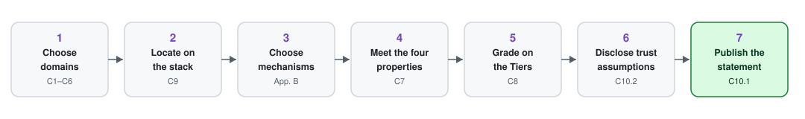

# Using Proof-of-Control

## Who It's For

The first adopters are security practitioners and leaders — the CISOs, security engineers, and auditors who answer for what an agent did and need evidence, not the vendor's claim about it. It is written just as deliberately for product and business owners, AI safety and responsible-AI leads, and policy and regulatory readers. Non-technical readers are a first-class audience: a governance decision only the technical team can read is not a governance decision.

* **For a CISO:** Proof-of-Control is the evidence substrate that lets you show an auditor, insurer, or regulator that your agents did only what they were authorized to do.
* **For an insurer or regulator:** setting the controls is not the same as verifying they held. Proof-of-Control is the evidence you can price and adjudicate against.

## Where Proof-of-Control Attaches

A reader with a system already running asks first where this standard touches it. It attaches at the point where a control is evaluated and an action is taken. In this standard that point has a name and a requirement: the **Action Interception Gateway** ([C7.1](0x10-C07-Evidence-Generation-and-Properties.md)), an out-of-band process or service that every agent tool and effect invocation is routed through, with no path around it.

Three bands, and only the middle one is in scope:

| Band | What sits there | In scope? |
| --- | --- | --- |
| **Intent** | Mandates, policies, contracts, and the translation between them | **No.** How a broad mandate became a specific policy is the operator's work, and this standard never judges whether the control chosen was adequate ([C8](0x10-C08-Verifiability-Tiers.md)). |
| **The action boundary** | Where a control is evaluated and an action is taken | **Yes.** Every control-governed action either stayed inside its control or did not, and that binary fact is what the standard requires evidence of ([C7](0x10-C07-Evidence-Generation-and-Properties.md)), located on the System surface ([C9](0x10-C09-System-Surface-MAESTRO.md)). |
| **The stack** | Runtime, weights, model code, training data | **No, deliberately.** The requirements apply the same way to a proprietary model reached through an API and to a published model running on the operator's own hardware, and ask the same evidence of both. |

Nothing above the boundary is in scope. Nothing below it has to be open. The boundary is where the evidence is made.

**Where to start.** An operator does not instrument everything at once. Start where you already make claims: every control asserted to a counterparty — in a contract, a policy, or a compliance packet — is a control already committed to. Those are the first entries in the claim register, evidenced one at a time, in the order the operator's own risk dictates ([C10](0x10-C10-Conformance-and-Disclosure.md)).

## Requirement Levels

Each requirement in chapters C1–C10 is assigned a level from 1 to 4, **aligned one-to-one with the Verifiability Tiers** ([C8](0x10-C08-Verifiability-Tiers.md)): meeting the Level-N requirements is what makes evidence gradable at Tier N. Levels are cumulative — a claim at Tier N must satisfy every requirement at Level N and below.

| Level | Name | Aligned to | What it means |
| :---: | --- | --- | --- |
| **1** | Recorded | Tier 1 · Assertion | The control operates and its evidence is captured contemporaneously in queryable records. The on-ramp: internal assurance only. |
| **2** | Attested | Tier 2 · Attestation | Evidence is cryptographically signed, hash-chained, or attested, so an assessor with access can confirm it has not been altered. |
| **3** | Independently Verifiable | Tier 3 · **the binary threshold** | Evidence is mechanism-generated and checkable by any external party with published tooling and no privileged access. **Meeting all Level 1–3 requirements in the claimed domains is the minimum for a Proof-of-Control claim.** |
| **4** | Self-Enforcing / Continuous | Tier 4 · Self-Enforcing | Verification gates operation: every in-scope action is validated as it occurs, and the system fails closed when evidence cannot be produced. Corresponds to Continuously Monitored operation. |

Organizations should select a target level based on the risk profile of the agent system. Levels 1–2 are a deliberate maturity on-ramp — valuable internal assurance, but **not yet Proof-of-Control**. The strongest verification is usually the most expensive; the graded path exists so adopters climb deliberately rather than having one level prescribed for everyone.

## How to Audit Against This Standard

Every requirement is written to be checked against a concrete artifact, and each section ends with an **"Auditor evidence"** note listing, per requirement ID, what to collect and what to test. An audit runs in four passes:

1. **Scope:** confirm the conformance statement's system boundary and in-scope action classes ([C10.1.6](0x10-C10-Conformance-and-Disclosure.md)) match the deployed system — including testing that one "excluded" action class is genuinely excluded.
2. **Existence (Level 1):** for each claimed domain, pull the named records, registers, and mappings; sample actions end-to-end.
3. **Integrity (Level 2):** validate signatures, hash chains, attestation reports, and key custody; exercise at least one failure path per section (a rejected action, a broken chain, a failed validation).
4. **Independence (Level 3) and gating (Level 4):** re-run the published verification tooling yourself, without operator credentials; at Level 4, run the fail-closed and halt tests.

## How to Use This Standard

* **During design:** use the requirements as an architecture checklist — the Action Interception Gateways of [C7](0x10-C07-Evidence-Generation-and-Properties.md) are structural and hard to retrofit.
* **During development:** build the evidence pipeline per domain chapter, using the [Proof-Mechanism Inventory](0x91-Appendix-B_Proof-Mechanism-Inventory.md) to pick mechanisms whose maturity fits.
* **During assessment:** use the requirements as the verification framework for a conformance stage ([C10](0x10-C10-Conformance-and-Disclosure.md)).
* **For procurement and insurance:** require the binary question — "does your system have Proof-of-Control?" — and compare vendors on their trust-assumption disclosures.

## Making Your First Proof-of-Control Claim

  <picture>
    <source media="(prefers-color-scheme: dark)" srcset="../../images/diagrams/first-claim-journey-dark.svg">
    
  </picture>

1. **Choose your domains:** decide which of the six domains ([C1](0x10-C01-Provenance.md)–[C6](0x10-C06-Security.md)) you make claims in. You may claim a subset. For each domain you claim, you produce evidence for the verifiable facts you assert.
2. **Locate where the evidence is produced:** map each claim to the agent stack using the System surface and its MAESTRO layers ([C9](0x10-C09-System-Surface-MAESTRO.md)).
3. **Choose the mechanisms:** select the proof mechanisms that generate the evidence ([Appendix B](0x91-Appendix-B_Proof-Mechanism-Inventory.md)). Match the mechanism to the evidentiary requirement ([C8.2](0x10-C08-Verifiability-Tiers.md)): a mechanism that proves an artifact's integrity at signing time proves nothing about its behavior at runtime.
4. **Meet the four evidence properties:** binary, contemporaneous, tamper-evident, transparent ([C7](0x10-C07-Evidence-Generation-and-Properties.md)).
5. **Grade each claim on the Verifiability Tiers:** place each claim at Tier 1 to 4 ([C8](0x10-C08-Verifiability-Tiers.md)). To count as Proof-of-Control, the evidence must clear the binary threshold: Tiers 3 and 4.
6. **Disclose your residual trust assumptions:** state, in the standardized disclosure, what still has to be trusted ([C10.2](0x10-C10-Conformance-and-Disclosure.md)).
7. **Publish a Self-Declared conformance statement:** your entry point ([C10.1](0x10-C10-Conformance-and-Disclosure.md)). Third-Party Assessed and Continuously Monitored come later.

For the infrastructure behind these steps, and the order to build it in, see the three-Phase implementation roadmap ([docs/roadmap.md](../../docs/roadmap.md), Part B).

## Reading a Proof-of-Control Claim

If you are assessing, buying, or insuring a system, four things tell you what a claim is worth: the **domains** it claims (C1–C6), the **Verifiability Tier** of each claim (C8), the **conformance stage** the claim was established at (C10), and the **trust-assumption disclosure**. Two systems can both be conformant and carry very different risk; the disclosure is what lets you tell them apart.

## Producing Evidence That Counts (implementer guidance, informative)

These are not requirements; they are the habits that separate evidence that holds up from evidence that does not.

* **Generate the evidence while the action happens, not after a dispute.** A contract creates a remedy after something goes wrong; evidence created at the moment of action is what lets anyone reconstruct what happened later.
* **Scope authority to the action, not to the actor.** Authority bound to its context cannot be replayed against a different action.
* **Carrying a signal is not enforcing it.** A system can transmit a consent flag, a policy, or a constraint and still not apply it. The standard asks for evidence that the constraint shaped behavior, not only that it was communicated.

## Getting Involved

The standard is developed in the open — **the front door is
[advancedaisociety.org](https://advancedaisociety.org/); sign up there to join.**

* **Comment on the draft:** the open decisions are collected in [Appendix D](0x93-Appendix-D_Open-Issues.md); those are the questions the working group most needs input on.
* **Join a working group:** six domain working groups plus an insurance working group where carriers, reinsurers, and actuaries define what the standard must carry to be priceable.
* **Contribute a crosswalk:** extend the [framework mappings](../../mappings/README.md).
* **Contribute a use case:** sector working groups produce the worked examples ([docs/use-cases.md](../../docs/use-cases.md)) that validate the standard against real deployments.

---

*Proof-of-Control is stewarded by the [Advanced AI Society](https://advancedaisociety.org/) —
**[join at advancedaisociety.org](https://advancedaisociety.org/)**.*
