# Using Proof-of-Control

## Who It's For

The first adopters are security practitioners and leaders — the CISOs, security engineers, and auditors who answer for what an agent did and need evidence, not the vendor's claim about it. It is written just as deliberately for product and business owners, AI safety and responsible-AI leads, and policy and regulatory readers. Non-technical readers are a first-class audience: a governance decision only the technical team can read is not a governance decision.

* **For a CISO:** Proof-of-Control is the evidence substrate that lets you show an auditor, insurer, or regulator that your agents did only what they were authorized to do.
* **For an insurer or regulator:** setting the controls is not the same as verifying they held. Proof-of-Control is the evidence you can price and adjudicate against.

## Requirement Levels

Each requirement in chapters C1–C10 is assigned a level indicating the depth of assurance:

| Level | Description | When to use |
| :---: | --- | --- |
| **1** | Baseline requirements for any Proof-of-Control claim in the chapter's scope. Without these, the claim does not clear the [binary threshold](0x10-C08-Verifiability-Tiers.md). | Every system claiming Proof-of-Control. |
| **2** | Extended requirements for systems handling sensitive data or making consequential decisions. Aligned with **Third-Party Assessed** readiness. | Production systems, regulated data, consequential agent actions. |
| **3** | Advanced requirements for high-assurance environments: Tier 4 self-enforcing execution and **Continuously Monitored** operation. | Critical infrastructure, high-value targets, cross-organizational agent chains. |

Organizations should select a target level based on the risk profile of the agent system. The strongest verification is usually the most expensive; the graded path exists so adopters choose the level that matches their risk and budget deliberately, rather than having one level prescribed for everyone.

## How to Use This Standard

* **During design:** use the requirements as an architecture checklist — the Action Interception Gateways of [C7](0x10-C07-Evidence-Generation-and-Properties.md) are structural and hard to retrofit.
* **During development:** build the evidence pipeline per domain chapter, using the [Proof-Mechanism Inventory](0x91-Appendix-B_Proof-Mechanism-Inventory.md) to pick mechanisms whose maturity fits.
* **During assessment:** use the requirements as the verification framework for a conformance stage ([C10](0x10-C10-Conformance-and-Disclosure.md)).
* **For procurement and insurance:** require the binary question — "does your system have Proof-of-Control?" — and compare vendors on their trust-assumption disclosures.

## Making Your First Proof-of-Control Claim

```mermaid
flowchart LR
    S1["1️⃣ Choose<br/>domains<br/><i>C1&#8211;C6</i>"]
    S2["2️⃣ Locate on<br/>the stack<br/><i>C9</i>"]
    S3["3️⃣ Choose<br/>mechanisms<br/><i>App. B</i>"]
    S4["4️⃣ Meet the four<br/>properties<br/><i>C7</i>"]
    S5["5️⃣ Grade on<br/>the Tiers<br/><i>C8</i>"]
    S6["6️⃣ Disclose trust<br/>assumptions<br/><i>C10.2</i>"]
    S7["7️⃣ Publish the<br/>statement<br/><i>C10.1</i>"]
    S1 --> S2 --> S3 --> S4 --> S5 --> S6 --> S7
    style S7 fill:#d1e7dd,stroke:#5cb85c,color:#0a3622
```

1. **Choose your domains:** decide which of the six domains ([C1](0x10-C01-Provenance.md)–[C6](0x10-C06-Security.md)) you make claims in. You may claim a subset. For each domain you claim, you produce evidence for the verifiable facts you assert.
2. **Locate where the evidence is produced:** map each claim to the agent stack using the System surface and its MAESTRO layers ([C9](0x10-C09-System-Surface-MAESTRO.md)).
3. **Choose the mechanisms:** select the proof mechanisms that generate the evidence ([Appendix B](0x91-Appendix-B_Proof-Mechanism-Inventory.md)). Match the mechanism to the evidentiary requirement ([C8.2](0x10-C08-Verifiability-Tiers.md)): a mechanism that proves an artifact's integrity at signing time proves nothing about its behavior at runtime.
4. **Meet the four evidence properties:** binary, contemporaneous, tamper-evident, transparent ([C7](0x10-C07-Evidence-Generation-and-Properties.md)).
5. **Grade each claim on the Verifiability Tiers:** place each claim at Tier 1 to 4 ([C8](0x10-C08-Verifiability-Tiers.md)). To count as Proof-of-Control, the evidence must clear the binary threshold: Tiers 3 and 4.
6. **Disclose your residual trust assumptions:** state, in the standardized disclosure, what still has to be trusted ([C10.2](0x10-C10-Conformance-and-Disclosure.md)).
7. **Publish a Self-Declared conformance statement:** your entry point ([C10.1](0x10-C10-Conformance-and-Disclosure.md)). Third-Party Assessed and Continuously Monitored come later.

For the infrastructure behind these steps, and the order to build it in, see the three-Phase implementation roadmap ([docs/roadmap.md](../../docs/roadmap.md), Part B).

## Reading a Proof-of-Control Claim

If you are assessing, buying, or insuring a system, four things tell you what a claim is worth: the **domains** it claims (C1–C6), the **Verifiability Tier** of each claim (C8), the **conformance stage** the claim was established at (C10), and the **trust-assumption disclosure**. Two systems can both be conformant and carry very different risk; the disclosure is what lets you tell them apart.

## Producing Evidence That Counts (implementer guidance, informative)

These are not requirements; they are the habits that separate evidence that holds up from evidence that does not.

* **Generate the evidence while the action happens, not after a dispute.** A contract creates a remedy after something goes wrong; evidence created at the moment of action is what lets anyone reconstruct what happened later.
* **Scope authority to the action, not to the actor.** Authority bound to its context cannot be replayed against a different action.
* **Carrying a signal is not enforcing it.** A system can transmit a consent flag, a policy, or a constraint and still not apply it. The standard asks for evidence that the constraint shaped behavior, not only that it was communicated.

## Getting Involved

The standard is developed in the open — **the front door is
[advancedaisociety.org](https://advancedaisociety.org/); sign up there to join.**

* **Comment on the draft:** the open decisions are collected in [Appendix D](0x93-Appendix-D_Open-Issues.md); those are the questions the working group most needs input on.
* **Join a working group:** six domain working groups plus an insurance working group where carriers, reinsurers, and actuaries define what the standard must carry to be priceable.
* **Contribute a crosswalk:** extend the [framework mappings](../../mappings/README.md).
* **Contribute a use case:** sector working groups produce the worked examples ([docs/use-cases.md](../../docs/use-cases.md)) that validate the standard against real deployments.

---

*Proof-of-Control is stewarded by the [Advanced AI Society](https://advancedaisociety.org/) —
**[join at advancedaisociety.org](https://advancedaisociety.org/)**.*
