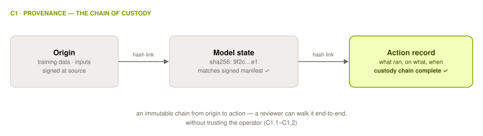

# C1 Provenance

## Control Objective

Produce verifiable evidence of origin and lineage: where inputs came from, which exact model state produced an output, what computation substrate executed the work, and how an immutable custody chain links origin to the action record. Provenance answers the question: can you show the chain of custody from origin to output?

*Verifiable facts: which model ran, and its lineage, artifact and supply-chain origin.*

Provenance is the domain the others rest on: what came in determines what any later verification is worth. It is distinct from the other five: [Identity](0x10-C05-Identity.md) covers who the actor was, and [Authorization](0x10-C04-Authorization.md) covers whether the system acted within the permissions it was granted; no single domain answers who did what on its own. Identity, Authorization and Provenance together are what make an action attributable.

  <picture>
    <source media="(prefers-color-scheme: dark)" srcset="../../images/diagrams/c1-provenance-dark.svg">
    
  </picture>

---

## C1.1 Model and Artifact Provenance

Each action must bind to a specific model state rather than a product label alone. This is especially critical for systems that change after deployment.

| # | Description | Level |
| :--------: | ------------------------------------------------------------------------------------------------------------------- | :---: |
| **1.1.1** | **Verify that** every execution record includes the cryptographic digest (e.g., SHA-256) of the model weights and serving configuration that produced the output, not only a product or version name. | 1 |
| **1.1.2** | **Verify that** at model load time the digest of the deployed weights is compared against a signed model manifest, and that each comparison result (pass or fail) is written to the execution record. | 2 |
| **1.1.3** | **Verify that** the signature chain over model artifacts — base weights, fine-tuning steps, serving config — validates end-to-end using signing keys enrolled in a maintained list of authorized providers, and that chain-validation failures block deployment. | 2 |
| **1.1.4** | **Verify that** the artifact-admission control rejects models, tools, and plugins that lack a valid attestation, and that each rejection event is recorded with the artifact identifier and reason. | 2 |
| **1.1.5** | **Verify that** model supply-chain provenance is published in a standard, externally verifiable attestation format (e.g., SLSA provenance / in-toto), so a party outside the organization can validate the build chain without operator assistance. | 3 |

**Auditor evidence:** 1.1.1 — sample execution records; confirm digest field present and resolvable to a manifest. 1.1.2 — load-time verification logs, including at least one recorded failure path (test it). 1.1.3 — signing-key inventory, chain-validation CI output, a blocked-deployment record. 1.1.4 — admission-control config plus rejection log entries. 1.1.5 — retrieve and independently validate one published provenance attestation. <!--aais-allow-->

---

## C1.2 Input and Data Lineage

Where inputs came from, and the custody chain that links origin to the action record.

| # | Description | Level |
| :--------: | ------------------------------------------------------------------------------------------------------------------- | :---: |
| **1.2.1** | **Verify that** each input that steers agent behavior (prompts, retrieved documents, memory reads, tool outputs) is recorded at ingestion with a source identifier and timestamp. | 1 |
| **1.2.2** | **Verify that** input records are hash-linked to the execution records of the actions whose context they were present in at evaluation time, forming a custody chain a reviewer can walk from origin to action. | 2 |
| **1.2.3** | **Verify that** each transformation applied to data feeding the agent (chunking, embedding, redaction, enrichment) appends an entry to a hash-linked, append-only log naming the process, its version, and digests of input and output. | 2 |
| **1.2.4** | **Verify that** training-data lineage and licensing attestations for the model in use are obtainable by an external verifier, and that the conformance claim links to them. | 3 |

**Auditor evidence:** 1.2.1 — ingestion log schema and samples. 1.2.2 — walk one custody chain end-to-end from a sampled action back to its inputs. **Presence, not influence:** a reviewer walking the chain establishes that an input was in the context, not that it steered the decision. 1.2.3 — pipeline log entries; recompute one input/output digest pair. 1.2.4 — follow the claim's lineage link as an outsider.

---

## C1.3 Compute Substrate Provenance

What executed the work, evidenced rather than asserted.

| # | Description | Level |
| :--------: | ------------------------------------------------------------------------------------------------------------------- | :---: |
| **1.3.1** | **Verify that** the execution record identifies the compute environment that ran the workload (host or cluster identity, environment image digest). | 2 |
| **1.3.2** | **Verify that** substrate identity is backed by a hardware or remote attestation report that a party outside the organization can validate against published reference values. | 3 |

**Auditor evidence:** 1.3.1 — sampled records with environment fields; match against deployment inventory. 1.3.2 — obtain one attestation report and validate it against the published reference values without operator assistance.

---

## C1.4 Privacy-Preserving Provenance

Where [Privacy](0x10-C02-Privacy.md) requires minimization, conformant provenance uses derived rather than raw evidence.

| # | Description | Level |
| :--------: | ------------------------------------------------------------------------------------------------------------------- | :---: |
| **1.4.1** | **Verify that** provenance records retain digests, commitments, or redacted derivations of payloads — not raw payloads — wherever the data handled is subject to minimization requirements. | 1 |
| **1.4.2** | **Verify that** an external verifier can confirm a provenance claim about confidential inputs (e.g., via hash comparison or selective disclosure) without being shown the underlying data. | 3 |

**Auditor evidence:** 1.4.1 — inspect stored provenance records for raw-payload leakage. 1.4.2 — perform one verification yourself using only the disclosed derivation.

---

## References

* [SLSA — Supply-chain Levels for Software Artifacts](https://slsa.dev/) · [in-toto](https://in-toto.io/) · [Sigstore](https://www.sigstore.dev/)
* [C2PA — Coalition for Content Provenance and Authenticity](https://c2pa.org/)
* Catena-X AI Service KIT — AI Service Passports and identity-anchored cross-organizational model provenance, a live deployment pattern for this chapter ([research basis](../../docs/research-basis.md))
* [MITRE ATLAS](https://atlas.mitre.org/) — training-time poisoning and supply-chain threats
* Crosswalks: [MAESTRO L1/L2 controls](0x91-Appendix-B_Proof-Mechanism-Inventory.md), [OWASP](../../mappings/owasp.md), [MITRE ATLAS](../../mappings/mitre-atlas.md)

> **Why 1.2.2 says "present in at evaluation time" rather than "influenced".** An
> earlier draft required input records to be linked to the actions *they influenced*.
> Influence is why-provenance: determining which retrieved chunk steered a decision is
> an open research problem, and no production system computes it. The closest tractable
> relation is *was present in the context*, an over-approximation that includes every
> document the model ignored. Every implementer meeting the earlier wording was in fact
> meeting this one and calling it the stronger name. A requirement at Level 2 — expected
> of ordinary conformance — must be one an implementer can actually satisfy and an
> auditor can actually check.
