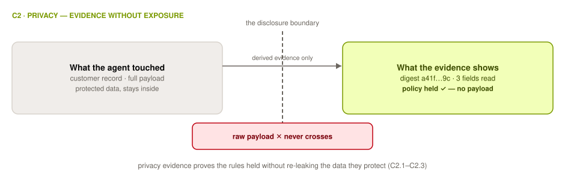

# C2 Privacy

## Control Objective

Produce verifiable evidence that data handling stayed within the defined privacy parameters at execution — evidence that is itself produced without exposing the data being protected. Privacy is the domain where verification is itself a privacy problem: the evidence must demonstrate compliance without re-leaking the inputs the compliance was intended to protect.

*Verifiable facts: what data was read and written.*

Privacy covers what data is touched, under what constraints, and that those constraints held. This is distinct from [Authorization](0x10-C04-Authorization.md) (is the system permitted to act) and [Identity](0x10-C05-Identity.md) (who acted).

  <picture>
    <source media="(prefers-color-scheme: dark)" srcset="../../images/diagrams/c2-privacy-dark.svg">
    
  </picture>

---

## C2.1 Data-Access Evidence

The execution record of what data was touched, with a clear boundary between what is used and what is disclosed.

| # | Description | Level |
| :--------: | ------------------------------------------------------------------------------------------------------------------- | :---: |
| **2.1.1** | **Verify that** every data read and write performed by the agent is recorded with the data-store identifier, record or object reference, operation type, and timestamp. | 1 |
| **2.1.2** | **Verify that** privacy evidence records contain identifiers, digests, or classifications of the data touched — never the protected content itself — and that a periodic scan of the evidence store confirms this. | 2 |
| **2.1.3** | **Verify that** each execution record distinguishes data *used* by the agent from data *disclosed* to an output, tool, or third party, as separate fields a reviewer can query. | 1 |

**Auditor evidence:** 2.1.1 — sampled access records reconciled against database/audit logs. 2.1.2 — evidence-store scan results (e.g., DLP scan) plus your own spot-check for raw content. 2.1.3 — query the records for a sampled action; confirm used vs. disclosed are separable.

---

## C2.2 Policy and Consent Enforcement

Carrying a signal is not enforcing it: the standard asks for evidence that the constraint shaped behavior, not only that it was communicated.

| # | Description | Level |
| :--------: | ------------------------------------------------------------------------------------------------------------------- | :---: |
| **2.2.1** | **Verify that** each data access is evaluated against the applicable consent record before execution, and that the evaluation result — including denials — is written to the execution record. | 2 |
| **2.2.2** | **Verify that** each data access records the declared purpose it was made under, and that accesses whose purpose does not match the data's permitted purposes are blocked and logged. | 2 |
| **2.2.3** | **Verify that** agent data queries are constrained (by scope, field allow-lists, or query rewriting) to the data required for the task, and that the constraint configuration and its enforcement events are recorded. | 2 |
| **2.2.4** | **Verify that** license and data-residency constraints are encoded as machine-enforced rules (e.g., region pinning, license tags), and that rule evaluations at execution are recorded. | 2 |
| **2.2.5** | **Verify that** where deidentified data is used, the deidentification step logs the method and version applied, and re-identification attempts (joins against restricted sources) are blocked and logged. | 2 |

**Auditor evidence:** 2.2.1 — trace one consented and one denied access through consent record → evaluation → outcome. 2.2.2 — purpose fields in sampled records; a blocked mismatched-purpose event. 2.2.3 — query-constraint config plus enforcement log. 2.2.4 — residency/license rule set and evaluation records. 2.2.5 — deidentification job logs and a blocked-join event.

---

## C2.3 Privacy-Preserving Verification Mechanisms

Because zero-knowledge techniques can confirm a fact without revealing the information behind it, openness of the verification and privacy of what is verified are not opposed.

| # | Description | Level |
| :--------: | ------------------------------------------------------------------------------------------------------------------- | :---: |
| **2.3.1** | **Verify that** where evidence at Tier 3 would re-leak protected inputs, the implementation substitutes a zero-knowledge proof of policy adherence, a selective disclosure, or a commitment — and that an external verifier can validate it without seeing the inputs. | 3 |
| **2.3.2** | **Verify that** consent records are committed to (hashed and anchored) at the time consent is captured, so a later consent record can be proven unaltered and not backdated. | 3 |
| **2.3.3** | **Verify that** computations over confidential inputs produce a proof of correct execution (verifiable computation) that gates the release of the result. | 4 |

**Auditor evidence:** 2.3.1 — validate one proof/disclosure yourself with the published verifier. 2.3.2 — recompute a consent commitment and check its anchor timestamp. 2.3.3 — the proof-gating configuration; confirm a result cannot be released without a valid proof (test the failure path).

---

## C2.4 Evidence Handling for Protected Data

The evidence store must not become a second copy of the data the domain protects, and tamper-evidence must be reconcilable with deletion obligations.

| # | Description | Level |
| :--------: | ------------------------------------------------------------------------------------------------------------------- | :---: |
| **2.4.1** | **Verify that** evidence retained beyond the execution window contains only derived or minimized forms of protected data (hashes, commitments, selective disclosures), enforced by the evidence-pipeline schema rather than by convention. | 1 |
| **2.4.2** | **Verify that** a documented procedure reconciles data-subject deletion requests with tamper-evident evidence — e.g., crypto-shredding encrypted payloads while retaining hash-bound proofs — and that at least one executed deletion demonstrates the chain remains verifiable afterward. | 2 |

**Auditor evidence:** 2.4.1 — evidence schema definition; attempt to write a raw payload through the pipeline (should fail). 2.4.2 — the deletion procedure, one completed deletion ticket, and a post-deletion chain-verification run.

---

## References

* [EU AI Act (Regulation (EU) 2024/1689)](https://eur-lex.europa.eu/eli/reg/2024/1689/oj) — Privacy-domain external alignment target
* [HIPAA](https://www.hhs.gov/hipaa/index.html) — health-data governance alignment
* Crosswalks: [EU AI Act](../../mappings/eu-ai-act.md), [Confidential Computing](../../mappings/confidential-computing.md), [MAESTRO L2 privacy compliance attestation](0x91-Appendix-B_Proof-Mechanism-Inventory.md)
* Open working-group issue on verifiable-but-unlinkable identity: [Appendix D](0x93-Appendix-D_Open-Issues.md)
