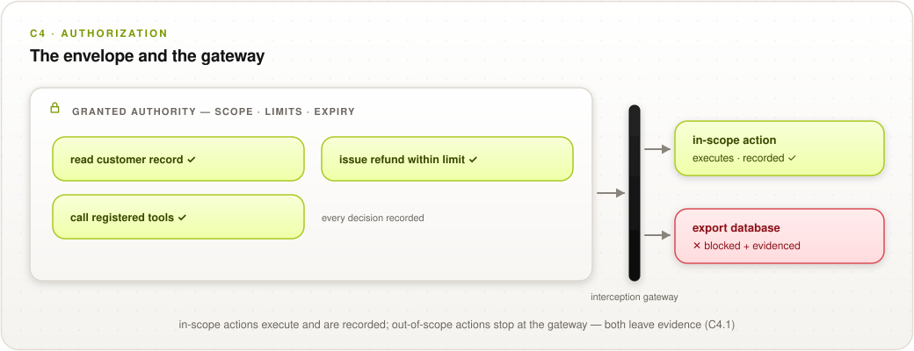

# C4 Authorization

## Control Objective

Produce verifiable evidence that the system acted within the permissions it was granted. This domain covers delegation-chain verification, scope and policy enforcement, signed authorization tokens checked against granted permissions, and the traceability of whether each agent action stayed within its authorized boundary — proving not just that the tool was authorized, but that its *evaluated payload parameters* matched the exact structural schema at execution time.

*Verifiable facts: authority granted, decisions within or against it, delegation validity.*

  <picture>
    <source media="(prefers-color-scheme: dark)" srcset="../../images/diagrams/c4-authorization-dark.svg">
    
  </picture>

---

## C4.1 Authority and Scope Enforcement

Authority is scoped to the action, not to the actor: permission tied to the specific operation, its configuration, and its limits at the time it acts cannot be replayed against a different action.

| # | Description | Level |
| :--------: | ------------------------------------------------------------------------------------------------------------------- | :---: |
| **4.1.1** | **Verify that** the authority granted to the agent — the permission set, its scope, and its expiry — is written to the execution record before the first action executes under it. | 1 |
| **4.1.2** | **Verify that** every action is evaluated against the granted permission set at execution time, and that the evaluation record names the permission matched (or the denial reason) for each action. | 1 |
| **4.1.3** | **Verify that** actions outside the granted scope are blocked at the interception gateway — not merely flagged — and that each block writes a rejection record with the attempted action and its parameters. | 3 |
| **4.1.4** | **Verify that** tool-call parameters are validated against the registered tool schema at execution time, that out-of-schema calls are rejected, and that the validated parameter digest is stored in the execution record. | 2 |
| **4.1.5** | **Verify that** agent credentials are issued per task with scope and expiry bound to that task (e.g., short-lived tokens), and that no standing broad-scope credential is available to the agent at runtime. | 2 |
| **4.1.6** | **Verify that** each human approval or override writes a record containing the approver's authenticated identity, the exact content presented for approval, the decision, and its timestamp. | 2 |
| **4.1.7** | **Verify that** authorization evaluation is path-aware: the evaluated context for each invocation includes parameters and state carried from upstream invocations in the same execution path, so that a composed sequence of individually authorized calls cannot silently exceed the authority of its steps. *(Research-driven addition — see [Appendix D, issue 12](0x93-Appendix-D_Open-Issues.md).)* | 2 |
| **4.1.8** | **Verify that** outputs of diagnostic, advisory, or audit tools cannot raise the authorization state of subsequent actions: approval thresholds are evaluated against the original grant, not against accumulated execution context. *(Research-driven addition — see [Appendix D, issue 12](0x93-Appendix-D_Open-Issues.md).)* | 2 |

**Auditor evidence:** 4.1.1 — grant records preceding sampled actions. 4.1.2 — per-action evaluation records including at least one denial. 4.1.3 — attempt an out-of-scope action in test; confirm block + rejection record. 4.1.4 — tool schema registry, a rejected malformed call, parameter digests in records. 4.1.5 — credential-issuance config and token lifetimes; search for standing credentials. 4.1.6 — sampled approval records; confirm the presented content matches what was actually executed. 4.1.7 — run a sandboxed composed-path test (an upstream skill supplying an expanded target to a downstream call) and confirm the path evaluation blocks it with a recorded decision. 4.1.8 — run a trust-transfer test (a benign diagnostic output preceding a high-risk request) and confirm the approval threshold is unchanged.

---

## C4.2 Delegation

Delegation validity is a verifiable fact; escalation through the chain must be provably impossible.

| # | Description | Level |
| :--------: | ------------------------------------------------------------------------------------------------------------------- | :---: |
| **4.2.1** | **Verify that** each action's signed authorization token is cryptographically validated (signature, expiry, audience, scope) before execution, and that validation results are recorded. | 2 |
| **4.2.2** | **Verify that** each hop in a delegation chain carries the delegator's signature, and that the full chain validates back to the originating principal before the delegated authority is exercised. | 2 |
| **4.2.3** | **Verify that** the delegation mechanism structurally prevents a delegate's permission set from exceeding the delegator's (scope intersection on issuance), and that attempted escalations are rejected and recorded. | 3 |
| **4.2.4** | **Verify that** where the delegation chain is confidential, the relying party receives a proof of policy-compliant delegation (e.g., ZK credential presentation) it can validate without seeing the chain. | 3 |

**Auditor evidence:** 4.2.1 — token-validation logs, including an expired/invalid-token rejection. 4.2.2 — walk one delegation chain's signatures to the principal. 4.2.3 — issuance code/config showing scope intersection; a rejected escalation attempt in test. 4.2.4 — validate one delegation proof using the published verifier.

> **[WG-INPUT NEEDED]** — whether identity-binding is owned by the Identity domain or by
> Authorization with Identity as an input (working-group lean: Authorization owns it, Identity as
> an input). See [Appendix D](0x93-Appendix-D_Open-Issues.md), issue 1.

---

## References

* [OWASP Top 10 for Agentic Applications](https://genai.owasp.org/) — excessive agency, tool misuse
* SCR-Bench (Xie et al., 2026) — Skill Composition Risk: capability-flow, trust-transfer, and authorization-confusion composition; the empirical basis for 4.1.7–4.1.8 ([research basis](../../docs/research-basis.md))
* [SOC 2 Type II](../../mappings/soc-2.md) — Authorization-domain external alignment target (proving runtime execution matched policy)
* Crosswalks: [MAESTRO L3/L6/L7 controls](0x91-Appendix-B_Proof-Mechanism-Inventory.md), [CSA AARM](../../mappings/csa-aarm.md)
* [Appendix D — Open Working-Group Issues](0x93-Appendix-D_Open-Issues.md)
