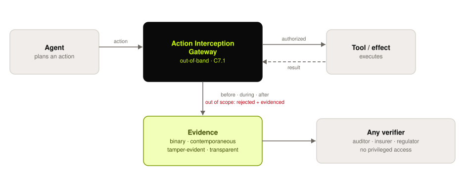

# C7 Evidence Generation and Properties

## Control Objective

Define what a piece of evidence must be to count under this standard, in any domain. Evidence must be generated by the enforcing mechanism at execution time, at an explicit interception boundary, and must satisfy the four evidence properties: **binary**, **contemporaneous**, **tamper-evident**, and **transparent**. The properties describe what the evidence must do, not how it must be built — they are technology-neutral.

These requirements apply to every claim made in the domain chapters [C1](0x10-C01-Provenance.md)–[C6](0x10-C06-Security.md). The controls a domain verifies can include deterministic checks on the agent's actions and outputs, such as rate limits, invariants, schema, and policy.

  <picture>
    <source media="(prefers-color-scheme: dark)" srcset="../../images/diagrams/evidence-flow-dark.svg">
    
  </picture>

*No side effect without evidence: the gateway sits out-of-band between the agent and its tools, and the evidence it emits — not the operator's account — is what a verifier checks.*

---

## C7.1 Generation at the Action Boundary

Verification evidence is generated where actions happen, preventing unverified side effects.

| # | Description | Level |
| :--------: | ------------------------------------------------------------------------------------------------------------------- | :---: |
| **7.1.1** | **Verify that** all agent tool and effect invocations are routed through an Action Interception Gateway that runs as a separate process or service from the agent — the agent has no network or credential path to its tools that bypasses the gateway. | 3 |
| **7.1.2** | **Verify that** for each intercepted action the gateway emits evidence records at three points — request received (before), effect performed (during), and result returned (after) — each independently signed and linkable to the same action ID. | 3 |
| **7.1.3** | **Verify that** the architecture makes evidence emission a precondition of action release: the gateway does not forward the action to the tool until the *before* record is durably written. | 3 |
| **7.1.4** | **Verify that** the effect channel is mediated within the same trust boundary as policy evaluation, by at least one of: (a) the credentials and transport for the effect are held inside the attesting environment, which emits the request itself; (b) the mechanism releases a single-use capability cryptographically bound to the evaluated snapshot digest and target resource, which the relying party checks before executing; or (c) egress is confined to an attested enforcement point that admits only requests carrying matching evidence. The conformance claim states which. | 3 |
| **7.1.5** | **Verify that** the claim does not assert that evidence describes executed actions unless 7.1.4 is met — a system evidencing evaluation but not mediating the effect channel may claim Tier 1–2 only. | 1 |

**Auditor evidence:** 7.1.1 — network policy and credential scoping showing no bypass path; attempt a direct tool call from the agent runtime in test. 7.1.2 — the three records for a sampled action, sharing one action ID. 7.1.3 — gateway configuration/code path for write-before-forward; test by making the evidence store unavailable and observing that actions do not proceed. 7.1.4 — the mediation option declared in the claim, plus a substitution test: submit snapshot A to the mechanism while attempting to dispatch action B, and confirm B is refused (option a/c) or rejected by the relying party (option b). 7.1.5 — check the claim's wording against the mediation option actually implemented.

---

## C7.2 The Contemporaneous Property

Evidence created at the moment of action is what lets anyone reconstruct what happened later; a system that plans to rebuild authority from mutable logs months afterward usually cannot.

| # | Description | Level |
| :--------: | ------------------------------------------------------------------------------------------------------------------- | :---: |
| **7.2.1** | **Verify that** each evidence record is written within the executing transaction of the action it describes — not batch-reconstructed later — and carries the capture timestamp of the event itself. | 1 |
| **7.2.2** | **Verify that** evidence timestamps are anchored to a source outside the operator's control — an RFC 3161 timestamp authority, transparency-log inclusion proof, or consensus time — at least once per defined anchoring interval. | 3 |
| **7.2.3** | **Verify that** the conformance claim states a maximum **attestation refresh interval** — the longest period, or the largest number of actions, for which evidence may rest on a hardware measurement taken before them — and that the mechanism refreshes within it or refuses to continue. | 3 |
| **7.2.4** | **Verify that** the hardware attestation cryptographically **binds the evidence signing key**: the key's digest appears in the attested report body (TDX `REPORTDATA`, SEV-SNP `REPORT_DATA`, or equivalent), so that a verifier establishes *this key ran inside this measured environment* rather than receiving a measurement and a key that merely arrived together. | 3 |

**Auditor evidence:** 7.2.1 — compare capture timestamps against source-system event times for sampled actions; look for batch-write signatures (identical write times across many events). 7.2.2 — the anchoring configuration and interval; validate one anchor proof independently. 7.2.3 — the declared interval and the refresh records over an audit window; confirm none exceeds it, and confirm the behaviour when a refresh fails. 7.2.4 — take one quote and recompute the expected report-data value from the published evidence key; a quote that does not commit to the key does not attest the key.

> **Why 7.2.3 exists.** Producing a hardware quote is expensive in a way the rest of the pipeline is not. Measured on Intel TDX (GCP C3, see [`impl/`](../../impl)): the software pipeline costs \~162 µs per action and running inside the trust domain adds only 6% to it, but a single quote costs **39.5 ms** — about 4,000× the trust-domain overhead, and 2.6× the entire 15 ms per-action budget on its own. Per-action attestation is therefore not merely expensive, it is impossible within any realistic latency budget, and every deployment will amortize one quote across many actions.
>
> That amortization is an exposure window, exactly like the anchoring interval in 7.6.6. Actions performed after a quote rest on a measurement taken before them; if the measured code changed in between, their evidence attests an environment that is no longer the one that ran. The interval must therefore be declared rather than left to whatever the implementation happens to do.

---

## C7.3 The Tamper-Evident Property

The evidence is produced by the cryptographic mechanism, not by the system operator.

| # | Description | Level |
| :--------: | ------------------------------------------------------------------------------------------------------------------- | :---: |
| **7.3.1** | **Verify that** evidence records are hash-chained or Merkle-anchored so that modifying, inserting, or reordering any record invalidates the chain, and that chain verification runs on a defined schedule with results recorded. | 2 |
| **7.3.2** | **Verify that** evidence records are signed by keys held by the generating mechanism (gateway, enclave, or logging service) that operator and agent identities cannot access, per the key-custody configuration. | 3 |
| **7.3.3** | **Verify that** the implementation resists equivocation (presenting divergent histories to different relying parties) by at least one of: cross-verifier consistency checking (gossip), a witness quorum co-signing chain roots, or anchoring to a ledger with single-history consensus — and that the mechanism is named in the claim. | 3 |
| **7.3.4** | **Verify that** the evidence log is structured so a verifier can establish that a **single named record** is present in the log committed to by a published root, without retrieving the rest of the log — by an inclusion proof against an append-only Merkle tree ([RFC 6962](https://www.rfc-editor.org/rfc/rfc6962)) or equivalent — and that the proof, the tree size it is taken against, and the published root are all obtainable by the verifier. | 3 |
| **7.3.5** | **Verify that** a published root is checked for **append-only consistency** against previously published roots, by a consistency proof or equivalent, and that the verification procedure compares the recomputed root against the anchored value rather than only against a step count or record count. | 3 |

**Auditor evidence:** 7.3.1 — chain-verification job schedule and results; alter one record in a test copy and confirm detection. 7.3.2 — key-custody ACLs; confirm operator accounts hold no signing capability for evidence keys. 7.3.3 — the named mechanism and its participants; obtain the same chain root from two independent verifiers or witnesses and confirm they agree. 7.3.4 — request an inclusion proof for one sampled record and verify it against the published root without being given the rest of the log; confirm the proof size grows logarithmically, not linearly, with log size. 7.3.5 — obtain two roots published at different times and verify a consistency proof between them; then rebuild a test log with one historical record altered and **re-signed**, and confirm the verifier rejects it.

> **Why 7.3.5 says "rather than only against a step count."** A verifier that compares only the number of records against the anchored step count will accept a rewritten history: an operator holding the signing key can alter a past record, recompute every subsequent link, and re-sign the whole log. The result has the right length and replays perfectly, because nothing about it is internally inconsistent. The only thing that contradicts it is the root that was published *before* the rewrite — which is worthless unless the verifier actually compares it. This defect was present in this specification's own reference implementation and was found by building the inclusion-proof experiment; see attack A9 in [`impl/`](../../impl).

---

## C7.4 The Transparent Property

Enterprises, insurers, and regulators can see exactly what must still be trusted.

| # | Description | Level |
| :--------: | ------------------------------------------------------------------------------------------------------------------- | :---: |
| **7.4.1** | **Verify that** the published trust-assumption disclosure ([C10.2](0x10-C10-Conformance-and-Disclosure.md)) lists, for each evidence mechanism in use, every party, hardware element, and mathematical assumption that must hold for the evidence to be believed. | 1 |

**Auditor evidence:** 7.4.1 — cross-check the disclosure against the mechanism inventory: every mechanism in [Appendix B](0x91-Appendix-B_Proof-Mechanism-Inventory.md) use has a corresponding disclosure line.

> **[WG-INPUT NEEDED]** — a possible fifth evidence property, *continuity across boundaries*
> (credited to Advait Patel). See [Appendix D](0x93-Appendix-D_Open-Issues.md), issue 5.

---

## C7.5 The Determinism Boundary

Verification establishes deterministic facts about execution, not the probabilistic content of what a model generated. The proposition "this model, given this input, produced this output at this time, in this environment, and passed it to this tool, which took this action within this authorization scope" is a set of deterministic facts, each true or false — each verifiable even though the model itself is non-deterministic. Verifiability does not require reproducibility: a tamper-evident record of a historical event is verifiable without re-running it.

| # | Description | Level |
| :--------: | ------------------------------------------------------------------------------------------------------------------- | :---: |
| **7.5.1** | **Verify that** every field in the evidence schema records an observable execution fact (identifier, digest, timestamp, decision result) — the schema contains no field asserting quality, correctness, or intent. | 1 |
| **7.5.2** | **Verify that** the conformance statement and public product claims describe the evidence only as execution facts, and that a documented claims review (legal or compliance sign-off) confirms no claim of output correctness, fairness, or model intent is attributed to Proof-of-Control. | 1 |

**Auditor evidence:** 7.5.1 — the evidence schema definition, field by field. 7.5.2 — the claims-review record and the current public claim text.

Proof-of-Control performs verification, not validation: it shows that an agent stayed inside the control boundaries that were set, and does not judge whether those boundaries were the right ones. That judgment — regulatory review, ethical evaluation, human oversight — stays a human responsibility.

---

## C7.6 Evidence Custody and Resilience

Tamper-evidence makes alteration detectable; it does not, by itself, make *omission* detectable, and it says nothing about what happens when the evidence pipeline fails. A system whose evidence generation can fail silently — or whose evidence store can be read by anyone, or deleted before a dispute — does not produce evidence that counts.

| # | Description | Level |
| :--------: | ------------------------------------------------------------------------------------------------------------------- | :---: |
| **7.6.1** | **Verify that** evidence-pipeline failures (write errors, signing errors, store unavailability) raise a monitored alert and are themselves written as failure events to a secondary durable log. | 2 |
| **7.6.2** | **Verify that** evidence records carry per-source monotonic sequence numbers (or equivalent chaining), so a verifier can detect a missing record from the sequence gap alone. | 2 |
| **7.6.3** | **Verify that** when evidence cannot be generated at the claimed Tier, in-scope actions are refused by the gateway until the pipeline recovers — demonstrated by a fail-closed test on the evidence store. | 4 |
| **7.6.4** | **Verify that** the evidence store enforces role-based access, and that every read of evidence writes its own access record (who, what, when). | 2 |
| **7.6.5** | **Verify that** the retention period for evidence is stated in the conformance claim, configured in the store's retention policy, and at least as long as the period the claim covers. | 1 |
| **7.6.6** | **Verify that** the chain root is anchored externally within a declared maximum interval, that the interval is stated in the claim (it bounds the window in which head truncation is undetectable), and that a missed anchoring deadline raises an alert. | 3 |

**Auditor evidence:** 7.6.1 — failure-event log and its alert route; break the pipeline in test. 7.6.2 — compute sequence continuity over a sampled window; remove a record in a test copy and confirm the gap is detectable. 7.6.3 — fail-closed test results. 7.6.4 — store ACLs and read-access records, including your own audit reads. 7.6.5 — claim text vs. store retention configuration. 7.6.6 — the declared interval, anchor records over an audit window (confirm none exceeds it), and one alert from a suppressed-anchor test.

---

## C7.7 The Interoperable Property

Evidence that only its producer can interpret is a log, not evidence. A second party has to be able to read it, recompute what it commits to, and arrive at the same bytes.

| # | Description | Level |
| :--------: | ------------------------------------------------------------------------------------------------------------------- | :---: |
| **7.7.1** | **Verify that** the evidence claim set is defined by a **machine-readable schema** covering every field, published where a verifier can obtain it, and that the deployed implementation's own output validates against it. | 2 |
| **7.7.2** | **Verify that** the schema declares a single **canonical serialization** — fixing key ordering, number formatting, string escaping, digest case, and the meaning of an absent field — and states exactly which bytes each digest and signature covers. | 2 |
| **7.7.3** | **Verify that** every digest and signature carries an explicit **algorithm identifier**, and that a verifier presented with an unidentified digest rejects it rather than assuming an algorithm. | 2 |
| **7.7.4** | **Verify that** conformance to the canonical form is demonstrated against **published test vectors including negative cases**, and that each negative vector is rejected for the reason it was written to test. | 3 |
| **7.7.5** | **Verify that** a parser rejects duplicate object keys rather than resolving them last-wins, so that one evidence artifact cannot mean different things to different readers. | 2 |

**Auditor evidence:** 7.7.1 — retrieve the schema; run a sample of production evidence through it. 7.7.2 — the canonicalization rules; hand the implementer a token in non-canonical form and confirm they canonicalize before verifying rather than hashing the bytes as received. 7.7.3 — present a digest with no algorithm tag and confirm rejection. 7.7.4 — run the vectors; a negative vector rejected for the *wrong* reason is not a pass, because it does not demonstrate the check exists. 7.7.5 — submit a token with a repeated key and confirm refusal.

> **Why this is a security property and not a documentation one.** The binding between an evaluated action and an executed one ([C7.1.4](#c71-generation-at-the-action-boundary)) works by recomputing a digest and comparing it. Two implementations that serialize the same action differently produce different digests for identical actions. Every signature still verifies, so nothing looks broken — the comparison simply fails, and the natural next step is to relax the comparison until interoperation works. That relaxation silently removes the property the comparison existed to provide. A canonical form with published test vectors is what prevents it. See [`schema/canonicalization.md`](../../schema/canonicalization.md), [`schema/poc-evidence.cddl`](../../schema/poc-evidence.cddl), and [`schema/vectors/`](../../schema/vectors).

---

## References

* [RFC 2119](https://www.rfc-editor.org/rfc/rfc2119) / [RFC 8174](https://www.rfc-editor.org/rfc/rfc8174) — requirements language · [RFC 3161](https://www.rfc-editor.org/rfc/rfc3161) — trusted timestamping
* [RFC 6962](https://www.rfc-editor.org/rfc/rfc6962) — Certificate Transparency: the Merkle tree structure C7.3.4/C7.3.5 adopt · [RFC 8785](https://www.rfc-editor.org/rfc/rfc8785) — JSON Canonicalization Scheme · [RFC 8949 §4.2](https://www.rfc-editor.org/rfc/rfc8949#section-4.2) — deterministic CBOR
* [RFC 9334](https://www.rfc-editor.org/rfc/rfc9334) — RATS architecture · [RFC 9711](https://www.rfc-editor.org/rfc/rfc9711) — Entity Attestation Token, which the claim set profiles
* [Appendix A — Glossary](0x90-Appendix-A_Glossary.md): evidence property, execution record, determinism boundary
* [Appendix C — Threat Model](0x92-Appendix-C_Threat-Model.md): what the evidence defends against, and the honest edge of the claim
* Crosswalk: [CSA AARM](../../mappings/csa-aarm.md) — the enforcement half at the same action boundary
