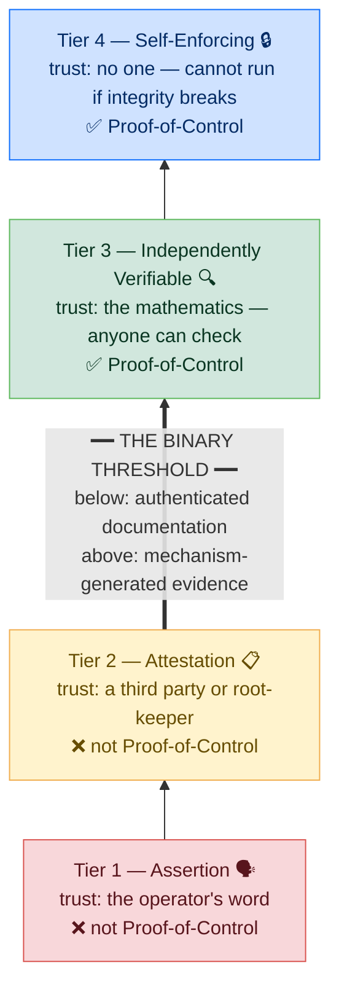

# C8 Verifiability Tiers and the Binary Threshold

## Control Objective

Grade every piece of evidence by how independently it can be verified — that is, how much you must trust to believe it — and draw the yes-or-no line that makes the category procurable. Verifiability is a four-tier scale, not a spectrum and not a maturity model. A system has Proof-of-Control when, and only when, its evidence reaches Tier 3 or Tier 4.

> **✍️ [DRAFT] — actively in progress.** This chapter is being worked on with the working group.

## The Four Tiers

|  | **Assertion — Tier 1** | **Attestation — Tier 2** | **Independently verifiable — Tier 3** | **Self-enforcing — Tier 4** |
| --- | --- | --- | --- | --- |
| **Proof-of-Control?** | No | No | **Yes** | **Yes** |
| **Who you must trust** | The operator | A third party, or the root-keeper | The cryptographic mechanism (mathematical or distributed assumptions) | The network protocol or continuous mathematical constraints |
| **How it is verified** | Not verified; asserted | An auditor checks, with privileged access | Anyone can verify, no privileged access | Execution is mechanically gated by cryptographic proofs; verification is continuous and automated |
| **What makes it this tier** | Their word | A third party vouches | The trusted party is removed | Enforcement is built in; it cannot run if integrity breaks |
| **Cryptography** | None | Can be cryptographic but centralized | Requires decentralized or trust-minimized cryptographic architectures | Execution layer is bound by the cryptographic proof (e.g., verifiable computation) |

The binary threshold falls between Tier 2 and Tier 3: below it, authenticated documentation (you still trust a party); above it, evidence produced by the mechanism itself. Below the line sit compliance frameworks, audit processes, contractual assurances, traditional security controls, and any cryptographic record whose integrity still depends on trusting a party — all valuable, none of them Proof-of-Control.

| Authenticated documentation (Tiers 1–2, not Proof-of-Control) | Cryptographic evidence (Tiers 3–4, Proof-of-Control) |
| --- | --- |
| The system operator produces logs or records, then signs them. The signature proves the log hasn't been altered after creation; it does not prove the log accurately reflects what happened. Trust required: the operator produced the log honestly. | The cryptographic mechanism generates evidence as a byproduct of execution itself — a ZK proof, a TEE attestation report, a consensus timestamp, a verifiable computation proof. Trust required: the cryptographic mechanism is sound. |

---

## C8.1 Tier Placement

The tier is set by how much you must trust, not by whether cryptography is used. Examples of cryptography that still sits at Tier 2: an operator publishing a hash of its own data; a system signing its own logs; traditional PKI rooted in a CA; a permissioned blockchain; a ZK proof with a single-party trusted setup; a TEE attestation rooted in the chip vendor's service; a centralized Merkle tree.

| # | Description | Level |
| :--------: | ------------------------------------------------------------------------------------------------------------------- | :---: |
| **8.1.1** | **Verify that** every claim is placed on the Verifiability Tiers (1 to 4). | 1 |
| **8.1.2** | **Verify that** tier placement is determined by how much trust is required, not by whether cryptography is used. | 1 |
| **8.1.3** | **Verify that** cryptographic records whose integrity depends on trusting a single party (operator-signed logs, single-party trusted setups, vendor-rooted attestations, centralized Merkle trees, permissioned ledgers) are graded no higher than Tier 2. | 1 |
| **8.1.4** | **Verify that** Proof-of-Control is claimed only when the evidence reaches Tier 3 or Tier 4 (the binary threshold). | 1 |
| **8.1.5** | **Verify that** Tier 3 and Tier 4 evidence is verifiable by parties other than the operator, without privileged access. | 1 |
| **8.1.6** | **Verify that** evidence that is independently verifiable but only checkable after the fact — a transparency log with independent monitors, an on-demand ZK proof the system can run without producing — is graded Tier 3, not Tier 4. | 1 |
| **8.1.7** | **Verify that** evidence relying on a vendor-rooted attestation service (e.g., a chip vendor's TEE attestation) is either graded Tier 2, or composed with independent anchoring (e.g., a public transparency log with independent monitors) to support a Tier 3 claim — with the residual vendor trust assumption disclosed in either case. | 1 |
| **8.1.8** | **Verify that** the verification method and the tooling needed to check the evidence are publicly documented and available, so that verification requires no privileged access and no agreement with the operator. | 1 |

---

## C8.2 Mechanism-to-Requirement Fit

The rule that prevents conformance gaming: conformance judges mechanism-to-requirement fit, not just mechanism presence.

| # | Description | Level |
| :--------: | ------------------------------------------------------------------------------------------------------------------- | :---: |
| **8.2.1** | **Verify that** each claimed control's evidence actually enforces the domain it is offered for; a control cannot satisfy a domain it does not enforce (an encryption control does not satisfy the Identity domain). | 1 |
| **8.2.2** | **Verify that** mechanism selection matches the control's evidentiary requirement: integrity of an artifact at signing time is not offered as evidence of behavior at runtime, and a TEE attestation of the environment is not offered as evidence about the model weights loaded into it. | 1 |

---

## C8.3 Chain Integrity and Self-Enforcement (Tier 4)

Tier 4 is where verification is continuous and built into operation: the system produces trustless evidence as it runs and cannot operate unless its integrity holds. A component may operate at a lower tier internally — a proprietary model or a piece of silicon can sit at Tier 1 or 2 on its own — as long as its *interactions* with other systems meet Proof-of-Control.

| # | Description | Level |
| :--------: | ------------------------------------------------------------------------------------------------------------------- | :---: |
| **8.3.1** | **Verify that** where a use case requires Tier 4, every system in the interaction chain attests up to Tier 4 for the interactions they share. | 3 |
| **8.3.2** | **Verify that** components operating at a lower tier internally preserve the integrity of the Tier-4 interactions they participate in. | 3 |
| **8.3.3** | **Verify that** at Tier 4, the system cannot operate unless its integrity holds (self-enforcing execution). | 3 |
| **8.3.4** | **Verify that** the availability dependency created by self-enforcing verification — the system halting when proofs cannot be produced — is assessed, and that the fail-closed behavior and its operational impact are documented in the claim. | 3 |

> ⚠️ **[WG-INPUT NEEDED]** — the binary threshold is the standard's most consequential definition
> and its most-scrutinized point; the working group must ratify it with dedicated cryptography
> and blockchain review, including impossibility results being formalized by researchers
> coordinated by Hart Montgomery (CTO, Linux Foundation Decentralized Trust). See
> [Appendix D](0x93-Appendix-D_Open-Issues.md), issue 6.

---

## References

* [Appendix A — Glossary](0x90-Appendix-A_Glossary.md): Verifiability Tiers, Tier, binary threshold terms
* [Appendix B — Proof-Mechanism Inventory](0x91-Appendix-B_Proof-Mechanism-Inventory.md): the mechanisms that produce Tier 3–4 evidence
* [Certificate Transparency](https://certificate.transparency.dev/) — the public transparency-log pattern
* Crosswalks: [Confidential Computing](../../mappings/confidential-computing.md) (Tier-2 caveat for vendor-rooted attestation), [SOC 2](../../mappings/soc-2.md)
