# C9 System Surface (MAESTRO)

## Control Objective

Locate every piece of evidence in the agent stack. Every verifiable fact covers some part of the system, and a claim that does not say where in the stack its evidence applies is incomplete. The System surface is a pluggable, normative axis; MAESTRO — the seven-layer agent-stack model authored by co-chair Ken Huang, part of the Cloud Security Alliance's agentic-security work — is the framework that fills it today. The axis is the standard's; the framework is pluggable, and other agent-surface frameworks or industry-specific iterations of MAESTRO may be recognized as the field matures.

```mermaid
flowchart TB
    L7["L7 🌐 Agent Ecosystem<br/>marketplaces &#183; registries &#183; other agents"]
    L6["L6 🏛️ Security, Governance &amp; Compliance<br/>policy &#183; change management &#183; audit"]
    L5["L5 📡 Evaluation &amp; Observability<br/>tamper-evident logging &#183; forensics"]
    L4["L4 🖥️ Deployment &amp; Infrastructure<br/>containers &#183; networks &#183; secrets &#183; TEEs"]
    L3["L3 🔁 Agent Framework<br/>planning &#183; tools &#183; workflows &#183; memory"]
    L2["L2 🗄️ Data Operations<br/>ingestion &#183; embeddings &#183; RAG"]
    L1["L1 🧠 Foundation Model<br/>weights &#183; serving &#183; behavioral policy"]
    L7 --- L6 --- L5 --- L4 --- L3 --- L2 --- L1
    style L5 fill:#6f42c1,stroke:#4c2d8f,color:#ffffff
```

*Every claim states which layer its evidence covers. Layer 5 (highlighted) is foundational to all the others: without tamper-evident records, no post-hoc proof is possible ([C9.2.1](#c92-layer-coverage)).*

The seven MAESTRO layers:

| Layer | Covers |
| :---: | --- |
| **L1** Foundation Model Security | Base model, weights, serving logic, fine-tuned variants, behavioral policies |
| **L2** Data Operations Security | Ingestion, preprocessing, embeddings, vector databases, RAG, retraining logs |
| **L3** Agent Framework Security | The agent loop: planning, tool selection, workflows, memory, multi-agent coordination |
| **L4** Deployment & Infrastructure Security | APIs, containers, orchestration, networks, secrets, hardware and TEEs |
| **L5** Evaluation & Observability | Monitoring, logging, evaluation, forensics |
| **L6** Security, Governance & Compliance | Policies, access-control models, change management, regulatory compliance |
| **L7** Agent Ecosystem Security | Users, other agents, marketplaces, registries, external services |

The full per-layer inventory of verifiable controls, proof mechanisms, and feasibility ratings is [Appendix B](0x91-Appendix-B_Proof-Mechanism-Inventory.md).

---

## C9.1 Locating Evidence on the System Surface

| # | Description | Level |
| :--------: | ------------------------------------------------------------------------------------------------------------------- | :---: |
| **9.1.1** | **Verify that** every entry in the claim register carries a populated layer field identifying the MAESTRO layer (1–7) its evidence covers. | 1 |
| **9.1.2** | **Verify that** the conformance statement names the framework filling the System surface (MAESTRO today) and its version. | 1 |
| **9.1.3** | **Verify that** the claim-register validation (schema check or intake review) rejects claim entries with a missing or invalid layer field, and that rejections are recorded. | 1 |

**Auditor evidence:** 9.1.1 — query the register for null/invalid layer fields (expect zero). 9.1.2 — the statement's framework declaration. 9.1.3 — the validation rule and one rejected-entry record from testing.

---

## C9.2 Layer Coverage

Layer 5 controls are foundational to every other layer: without tamper-evident records of system behavior, no post-hoc proof is possible.

| # | Description | Level |
| :--------: | ------------------------------------------------------------------------------------------------------------------- | :---: |
| **9.2.1** | **Verify that** tamper-evident logging (a Layer 5 control per [Appendix B](0x91-Appendix-B_Proof-Mechanism-Inventory.md)) is deployed and covering every system named in the claim's scope, as shown by the log-source inventory. | 2 |
| **9.2.2** | **Verify that** for each claim, the evidence is generated at the layer where the control is enforced, matching the layer listed for that control in [Appendix B](0x91-Appendix-B_Proof-Mechanism-Inventory.md) — e.g., runtime attestation evidenced at L4, delegation chains at L7. | 2 |
| **9.2.3** | **Verify that** claims spanning multiple layers aggregate their per-layer evidence into a hash-linked bundle referencing each layer's records, so the cross-layer claim is verifiable as one artifact. | 3 |

**Auditor evidence:** 9.2.1 — log-source inventory reconciled against the claim's scope declaration ([C10.1.6](0x10-C10-Conformance-and-Disclosure.md)). 9.2.2 — three sampled claims checked against Appendix B layer listings. 9.2.3 — validate one cross-layer bundle end-to-end.

---

## References

* [Cloud Security Alliance — MAESTRO agentic AI threat modeling](https://cloudsecurityalliance.org/blog/2025/02/06/agentic-ai-threat-modeling-framework-maestro)
* [Appendix B — Proof-Mechanism Inventory](0x91-Appendix-B_Proof-Mechanism-Inventory.md): the seven layer control tables and the mechanism taxonomy
* Crosswalks: [MAESTRO](../../mappings/maestro.md), [CSA AICM](../../mappings/csa-aicm.md), [CSA AARM](../../mappings/csa-aarm.md)
