# C9 System Surface (MAESTRO)

## Control Objective

Locate every piece of evidence in the agent stack. Every verifiable fact covers some part of the system, and a claim that does not say where in the stack its evidence applies is incomplete. The System surface is a pluggable, normative axis; MAESTRO — the seven-layer agent-stack model authored by co-chair Ken Huang, part of the Cloud Security Alliance's agentic-security work — is the framework that fills it today. The axis is the standard's; the framework is pluggable, and other agent-surface frameworks or industry-specific iterations of MAESTRO may be recognized as the field matures.

```mermaid
flowchart TB
    L7["L7 🌐 Agent Ecosystem<br/>marketplaces &#183; registries &#183; other agents"]
    L6["L6 🏛️ Security, Governance &amp; Compliance<br/>policy &#183; change management &#183; audit"]
    L5["L5 📡 Evaluation &amp; Observability<br/>tamper-evident logging &#183; forensics"]
    L4["L4 🖥️ Deployment &amp; Infrastructure<br/>containers &#183; networks &#183; secrets &#183; TEEs"]
    L3["L3 🔁 Agent Framework<br/>planning &#183; tools &#183; workflows &#183; memory"]
    L2["L2 🗄️ Data Operations<br/>ingestion &#183; embeddings &#183; RAG"]
    L1["L1 🧠 Foundation Model<br/>weights &#183; serving &#183; behavioral policy"]
    L7 --- L6 --- L5 --- L4 --- L3 --- L2 --- L1
    style L5 fill:#6f42c1,stroke:#4c2d8f,color:#ffffff
```

*Every claim states which layer its evidence covers. Layer 5 (highlighted) is foundational to all the others: without tamper-evident records, no post-hoc proof is possible ([C9.2.1](#c92-layer-coverage)).*

The seven MAESTRO layers:

| Layer | Covers |
| :---: | --- |
| **L1** Foundation Model Security | Base model, weights, serving logic, fine-tuned variants, behavioral policies |
| **L2** Data Operations Security | Ingestion, preprocessing, embeddings, vector databases, RAG, retraining logs |
| **L3** Agent Framework Security | The agent loop: planning, tool selection, workflows, memory, multi-agent coordination |
| **L4** Deployment & Infrastructure Security | APIs, containers, orchestration, networks, secrets, hardware and TEEs |
| **L5** Evaluation & Observability | Monitoring, logging, evaluation, forensics |
| **L6** Security, Governance & Compliance | Policies, access-control models, change management, regulatory compliance |
| **L7** Agent Ecosystem Security | Users, other agents, marketplaces, registries, external services |

The full per-layer inventory of verifiable controls, proof mechanisms, and feasibility ratings is [Appendix B](0x91-Appendix-B_Proof-Mechanism-Inventory.md).

---

## C9.1 Locating Evidence on the System Surface

| # | Description | Level |
| :--------: | ------------------------------------------------------------------------------------------------------------------- | :---: |
| **9.1.1** | **Verify that** every claim locates its evidence on the System surface: which layer of the agent stack the evidence is about. | 1 |
| **9.1.2** | **Verify that** the framework filling the System surface (MAESTRO today) is declared in the claim. | 1 |
| **9.1.3** | **Verify that** claims that do not state where in the stack their evidence applies are treated as incomplete. | 1 |

---

## C9.2 Layer Coverage

Layer 5 controls are foundational to every other layer: without tamper-evident records of system behavior, no post-hoc proof is possible.

| # | Description | Level |
| :--------: | ------------------------------------------------------------------------------------------------------------------- | :---: |
| **9.2.1** | **Verify that** tamper-evident logging (Layer 5) is in place for any claimed domain, since post-hoc proof depends on it. | 1 |
| **9.2.2** | **Verify that** evidence for each claim covers the layer where the corresponding control is enforced, per the per-layer inventory in [Appendix B](0x91-Appendix-B_Proof-Mechanism-Inventory.md). | 2 |
| **9.2.3** | **Verify that** evidence spanning multiple layers is aggregated in a tamper-evident way (e.g., hash-chained cross-layer aggregation). | 2 |

---

## References

* [Cloud Security Alliance — MAESTRO agentic AI threat modeling](https://cloudsecurityalliance.org/blog/2025/02/06/agentic-ai-threat-modeling-framework-maestro)
* [Appendix B — Proof-Mechanism Inventory](0x91-Appendix-B_Proof-Mechanism-Inventory.md): the seven layer control tables and the mechanism taxonomy
* Crosswalks: [MAESTRO](../../mappings/maestro.md), [CSA AICM](../../mappings/csa-aicm.md), [CSA AARM](../../mappings/csa-aarm.md)
