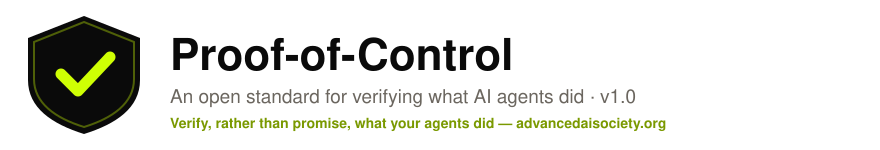
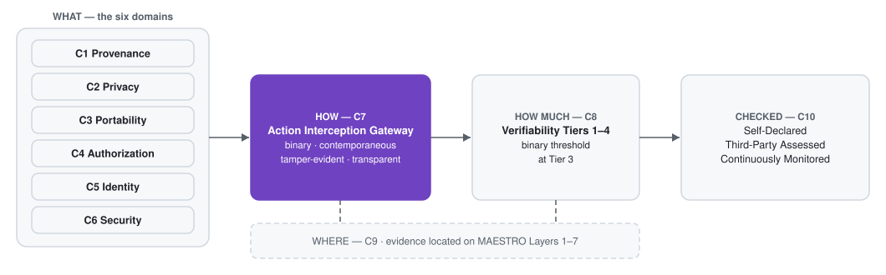
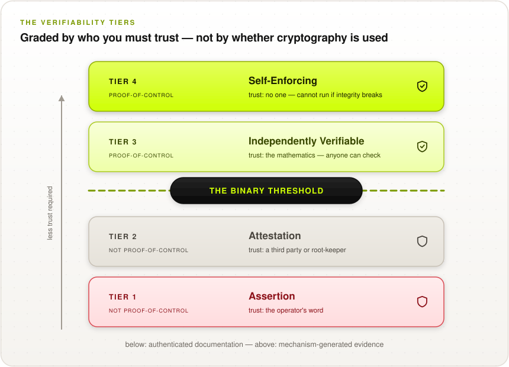
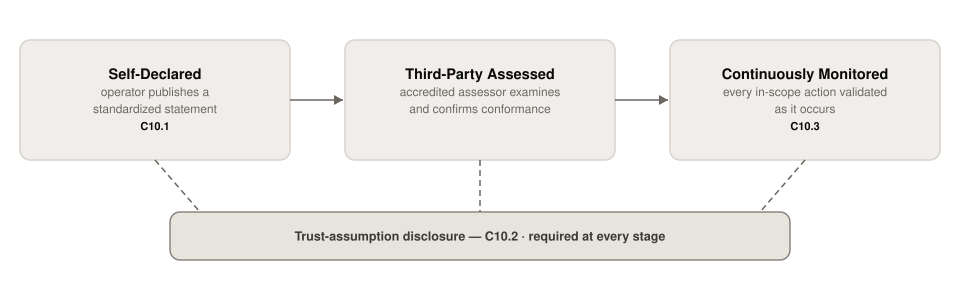

<p align="center">
  <picture>
    <source media="(prefers-color-scheme: dark)" srcset="images/poc-banner-dark.svg">
    <source media="(prefers-color-scheme: light)" srcset="images/poc-banner-light.svg">
    
  </picture>
</p>

<p align="center">
  <a href="https://creativecommons.org/licenses/by/4.0/"></a>
  <a href="0.1/en/0x01-Frontispiece.md"></a>
  <a href="0.1/en"></a>
  <a href="https://advancedaisociety.org/"></a>
</p>

> **📣 Get involved:** Proof-of-Control is developed in the open and stewarded by the
> **[Advanced AI Society](https://advancedaisociety.org/)**. Join a working group, comment on
> the draft, or become a member — **[sign up at advancedaisociety.org](https://advancedaisociety.org/)**.

## 🔎 What is Proof-of-Control?

The **Proof-of-Control Standard (PoC)** is a catalogue of verifiable requirements for AI agent systems: independent, tamper-evident evidence of what an agent actually did — the data it touched, the authority it exercised, the tools it invoked — in a form anyone can check **without trusting the operator**. Every requirement follows the same philosophy as [OWASP AISVS/ASVS](https://github.com/OWASP/AISVS): **verifiable, testable, and implementable**.

A system has Proof-of-Control when, and only when, its evidence reaches **Tier 3 or Tier 4** of the Verifiability Tiers — a binary threshold that makes the category procurable: *"Does your AI have Proof-of-Control?"* is a yes-or-no question.

> 🐕 **New to the standard? Start with the one-pager:** [**The Smart Leash**](docs/one-pager.md) —
> the whole standard in one analogy: from *"trust me"* to *"trust my auditor"* to *"trust the
> math"* to *the leash locks itself*.

## 🗺️ The Standard at a Glance

<p align="center">
  <picture>
    <source media="(prefers-color-scheme: dark)" srcset="images/diagrams/standard-at-a-glance-dark.svg">
    
  </picture>
</p>

## 🪜 The Binary Threshold

Evidence is graded by **who you must trust to believe it**. Cryptography alone doesn't raise the tier — removing the trusted party does.

<p align="center">
  <picture>
    <source media="(prefers-color-scheme: dark)" srcset="images/diagrams/tier-ladder-dark.svg">
    
  </picture>
</p>

| Tier | Name | Who you must trust | Proof-of-Control? |
| :---: | --- | --- | :---: |
| 4 | 🔒 Self-Enforcing | The protocol / continuous mathematical constraints | ✅ **Yes** |
| 3 | 🔍 Independently Verifiable | The cryptographic mechanism | ✅ **Yes** |
| 2 | 📋 Attestation | A third party, or the root-keeper | ❌ No |
| 1 | 🗣️ Assertion | The operator | ❌ No |

## 📚 Requirement Chapters

Chapters **C1–C6** are the six domains of verification — *what* must be verified. Chapters **C7–C10** are cross-cutting — what the evidence must *be*, how it is *graded*, *where* it applies, and how claims are *checked*.

| # | Chapter | Verifiable facts / scope |
| :---: | --- | --- |
| 🧬 | [C1: Provenance](0.1/en/0x10-C01-Provenance.md) | Which model ran; lineage, artifact and supply-chain origin |
| 🔐 | [C2: Privacy](0.1/en/0x10-C02-Privacy.md) | What data was read and written — evidenced without re-leaking it |
| 🌉 | [C3: Portability](0.1/en/0x10-C03-Portability.md) | Boundary crossings: organizational, jurisdictional, compute |
| 🎫 | [C4: Authorization](0.1/en/0x10-C04-Authorization.md) | Authority granted, decisions within or against it, delegation validity |
| 🪪 | [C5: Identity](0.1/en/0x10-C05-Identity.md) | Which agent and which principal ran |
| 🛡️ | [C6: Security](0.1/en/0x10-C06-Security.md) | Execution-environment integrity; controls held; tools invoked; key lifecycle |
| 🧾 | [C7: Evidence Generation & Properties](0.1/en/0x10-C07-Evidence-Generation-and-Properties.md) | Interception gateways; the four properties; determinism boundary; custody & resilience |
| 🪜 | [C8: Verifiability Tiers & Binary Threshold](0.1/en/0x10-C08-Verifiability-Tiers.md) | Tier placement, mechanism fit, chain integrity |
| 🏗️ | [C9: System Surface (MAESTRO)](0.1/en/0x10-C09-System-Surface-MAESTRO.md) | Locating evidence on the 7-layer agent stack |
| ✅ | [C10: Conformance & Disclosure](0.1/en/0x10-C10-Conformance-and-Disclosure.md) | Stages, scope declaration, trust-assumption disclosure |

### Appendices

| | Appendix | Contents |
| :---: | --- | --- |
| 📖 | [A: Glossary](0.1/en/0x90-Appendix-A_Glossary.md) | Normative terms and the Tier/Stage/Layer/Phase naming discipline |
| 🧰 | [B: Proof-Mechanism & Controls Inventory](0.1/en/0x91-Appendix-B_Proof-Mechanism-Inventory.md) | The 9-mechanism taxonomy and all seven MAESTRO layer control tables |
| ⚔️ | [C: Threat Model](0.1/en/0x92-Appendix-C_Threat-Model.md) | 32 threats: coverage 🟢🔵🟡⚪ and out-of-scope boundaries |
| ⚠️ | [D: Open Working-Group Issues](0.1/en/0x93-Appendix-D_Open-Issues.md) | Every `[WG-INPUT NEEDED]` decision, collected |
| ☑️ | [E: Audit Checklist](0.1/en/0x94-Appendix-E_Audit-Checklist.md) | All 111 requirements as tickable task lists, with the coverage matrix — generated, never stale |

### 🧮 Running an audit

The whole standard is available as a working checklist, in whichever form your audit runs on:

| Representation | Where | Use it for |
| --- | --- | --- |
| ☑️ Tickable task lists | [Appendix E](0.1/en/0x94-Appendix-E_Audit-Checklist.md) | Working an audit directly on GitHub, or copying into issues/tickets |
| 🗺️ Coverage matrix | [Appendix E](0.1/en/0x94-Appendix-E_Audit-Checklist.md#coverage-matrix) | Scoping: chapters × levels at a glance (34 L1 / 40 L2 / 26 L3 / 11 L4) |
| 📊 CSV export | [`checklist/poc-checklist.csv`](checklist/poc-checklist.csv) | Spreadsheet-driven audits — includes empty `status` and `auditor_notes` columns |
| 🔧 JSON export | [`checklist/poc-checklist.json`](checklist/poc-checklist.json) | GRC tooling and automation |
| 🔍 Auditor evidence notes | Every chapter section | What to collect and what to test, per requirement ID |

All of these are generated from the chapters by [`tools/generate_checklist.py`](tools/generate_checklist.py), so they cannot drift from the normative text.

## 📶 Requirement Levels

Each requirement carries a level (1–4), **aligned one-to-one with the Verifiability Tiers**: meeting the Level-N requirements is what makes evidence gradable at Tier N. Levels are cumulative, and every section ends with **"Auditor evidence"** guidance — what to collect and what to test, per requirement ID — so a compliance lead can scope an audit directly from the chapters.

| Level | Name | Aligned Tier | What it means |
| :---: | --- | :---: | --- |
| **1** | 🗣️ Recorded | Tier 1 | The control operates and its evidence is captured in queryable records — the on-ramp |
| **2** | 📋 Attested | Tier 2 | Evidence is signed, hash-chained, or attested; an assessor can confirm it unaltered |
| **3** | 🔍 Independently Verifiable | Tier 3 | Mechanism-generated evidence, checkable by outsiders with published tooling — **the binary threshold; minimum for a Proof-of-Control claim** |
| **4** | 🔒 Self-Enforcing / Continuous | Tier 4 | Verification gates operation: full coverage, fail-closed, Continuously Monitored |

## 🔁 How a Claim Gets Checked

<p align="center">
  <picture>
    <source media="(prefers-color-scheme: dark)" srcset="images/diagrams/conformance-stages-dark.svg">
    
  </picture>
</p>

Four things tell an assessor, buyer, or insurer what a claim is worth: the **domains** claimed (C1–C6), the **Tier** of each claim (C8), the **conformance stage** (C10), and the **trust-assumption disclosure** — the part that lets two conformant systems be priced differently.

## 🧭 Project Leadership

The standard is led by co-chairs **Ken Huang** and **Tricia Wang**, produced by the Proof-of-Control Initiative's working groups, reviewed by a Distinguished Review Board, and stewarded by the [Advanced AI Society](https://advancedaisociety.org/) as a public good ([Governance](docs/governance.md)). The Proof-of-Control Lab is being established as a community lab at Linux Foundation Decentralized Trust.

### What Proof-of-Control is NOT

* ❌ **Not validation.** PoC shows an agent stayed inside the control boundaries that were set; whether those boundaries — or the outputs — were *right* stays a human judgment ([C7.5](0.1/en/0x10-C07-Evidence-Generation-and-Properties.md)).
* ❌ **Not a governance or risk framework.** [NIST AI RMF](https://www.nist.gov/itl/ai-risk-management-framework), [ISO/IEC 42001](https://www.iso.org/standard/42001), and the EU AI Act govern; PoC produces the evidence that makes their requirements checkable.
* ❌ **Not a runtime enforcement layer.** Enforcement (what an agent *may* do) is CSA AARM's half; PoC is the evidence half (what it *did*, checkable by others).
* ❌ **Not tied to any technology or vendor.** The standard defines what the evidence must be, not which mechanism produces it.

## 📐 Regulatory Coverage

How much of Proof-of-Control each external framework already addresses — (Exact + Partial
matches) / 111 requirements, coded per the [mapping rubric](mappings/rubric.md) and reproducible
with `python3 mappings/compute_coverage.py`:

<p align="center">
  <picture>
    <source media="(prefers-color-scheme: dark)" srcset="images/diagrams/mapping-coverage-dark.svg">
    
  </picture>
</p>

| Framework | Coverage |
| --- | :---: |
| [NIST AI RMF](mappings/nist-ai-rmf.md) | **64%** |
| [ISO/IEC 42001](mappings/iso-iec-42001.md) | **61%** |
| [OWASP AISVS](mappings/owasp.md) | **60%** |
| [EU AI Act](mappings/eu-ai-act.md) | **57%** |
| [SOC 2](mappings/soc-2.md) | **57%** |
| [CSA AARM](mappings/csa-aarm.md) | **50%** |
| [Zero Trust (NIST SP 800-207)](mappings/zero-trust.md) | **44%** |
| [MITRE ATLAS](mappings/mitre-atlas.md) | **27%** |

The uncovered remainder — evidence gradability, the binary threshold, trust-assumption
disclosure, self-enforcing execution — is the gap Proof-of-Control exists to close. Full
EM/PM/NM breakdown, row-level [coding sheet](mappings/coding_sheet.csv), and corpus provenance
in [`mappings/`](mappings/README.md). *(Draft seed coding, pending working-group validation.)*

## 🧩 How PoC Complements Other Standards

| Standard | Focus | PoC relationship |
| --- | --- | --- |
| [CSA MAESTRO](mappings/maestro.md) | Agent threat modeling (7-layer stack) | Adopted as PoC's System surface ([C9](0.1/en/0x10-C09-System-Surface-MAESTRO.md)) |
| [CSA AARM](mappings/csa-aarm.md) | Runtime enforcement at the action boundary | Complementary halves: AARM enforces, PoC evidences |
| [OWASP Top 10s / AIVSS / AISVS](mappings/owasp.md) | Agent & LLM threats; AI security controls | Threat source for PoC's threat model; PoC adds the independent-evidence layer |
| [MITRE ATLAS](mappings/mitre-atlas.md) | Adversarial AI threat catalog | Threat source ([Appendix C](0.1/en/0x92-Appendix-C_Threat-Model.md)) |
| [NIST AI RMF](mappings/nist-ai-rmf.md) | AI risk governance | PoC supplies the runtime evidence RMF controls are checked against |
| [ISO/IEC 42001](mappings/iso-iec-42001.md) | AI management systems | PoC evidences that declared controls held at execution |
| [SOC 2](mappings/soc-2.md) | Organizational attestation | PoC is SOC-2-grade in role, with a cryptographic stage SOC 2 never had |
| [EU AI Act](mappings/eu-ai-act.md) | Regulation | PoC evidence lets rules be enforced against evidence, not filings |
| [Zero Trust](mappings/zero-trust.md) · [Confidential Computing](mappings/confidential-computing.md) · [AIUC-1](mappings/aiuc-1.md) | Architecture / mechanism / audit | See all crosswalks in [`mappings/`](mappings/README.md) |

## 📦 Repository Layout & Versioning

```text
/
├── 0.1/en/     <- the standard: chapters C1–C10 + appendices A–D  (Working Draft v0.1.4)
├── docs/       <- companion documents: the case for the standard, reviews
├── mappings/   <- framework crosswalks (MAESTRO, OWASP, NIST, SOC 2, EU AI Act, …)
├── images/     <- banner and artwork
```

PoC uses `v<MAJOR>.<MINOR>` versioning; released folders are locked, mirroring [OWASP ASVS](https://github.com/OWASP/ASVS)/[AISVS](https://github.com/OWASP/AISVS) ([RELEASE.md](RELEASE.md)). Version 1.0 is targeted for **February 1, 2027** ([roadmap](docs/roadmap.md)).

**Referencing requirements:** `C<chapter>.<section>.<requirement>`, version-qualified as `v0.1-C4.1.4`:

> Verify that the evaluated payload parameters of each tool invocation matched the exact structural schema authorized at execution time.

## 📚 Companion Documents

The case for the standard — informative, no requirements:

[Introduction & design principles](docs/introduction.md) · [Why verification matters](docs/why-verification-matters.md) · [Standards landscape](docs/standards-landscape.md) · [Use cases](docs/use-cases.md) · [The Smart Leash one-pager](docs/one-pager.md) · [Roadmap](docs/roadmap.md) · [Governance](docs/governance.md) · [Research basis](docs/research-basis.md) · [Reviews](docs/reviews/ciso-review-v0.1.4.md)

## 🤝 Contributing

We welcome contributions — see [CONTRIBUTING.md](CONTRIBUTING.md). The open decisions that most need input are collected in [Appendix D](0.1/en/0x93-Appendix-D_Open-Issues.md); security concerns follow the [Security Policy](SECURITY.md).

**Membership is open to any organization — [sign up at advancedaisociety.org](https://advancedaisociety.org/).**

## ⚖️ License

The specification is licensed under **[Creative Commons Attribution 4.0 International](https://creativecommons.org/licenses/by/4.0/)**. The certification mark ("Proof-of-Control Certified") is protected as a trademark so that only systems assessed as conformant may claim it.

---

<p align="center"><i>Proof-of-Control is stewarded by the <a href="https://advancedaisociety.org/">Advanced AI Society</a>.<br/>Help build the evidence layer for AI governance — <b><a href="https://advancedaisociety.org/">join at advancedaisociety.org</a></b>.</i></p>
