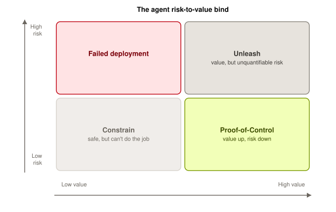
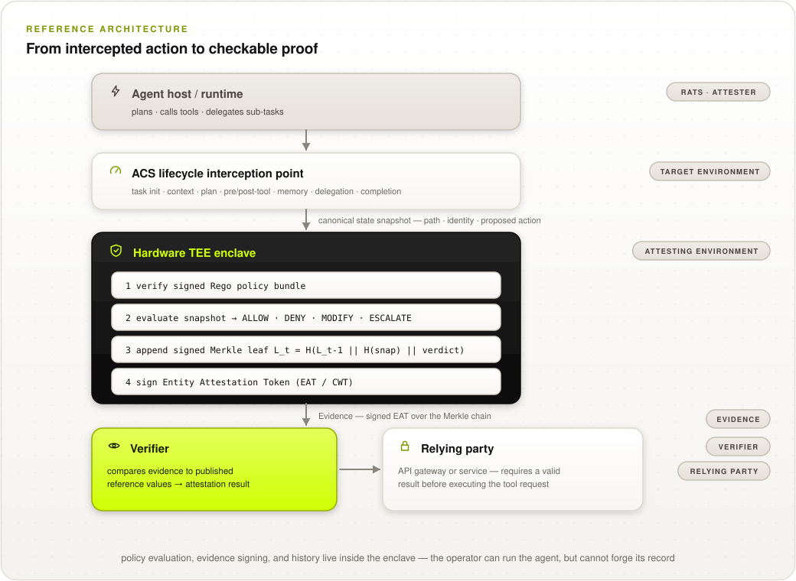
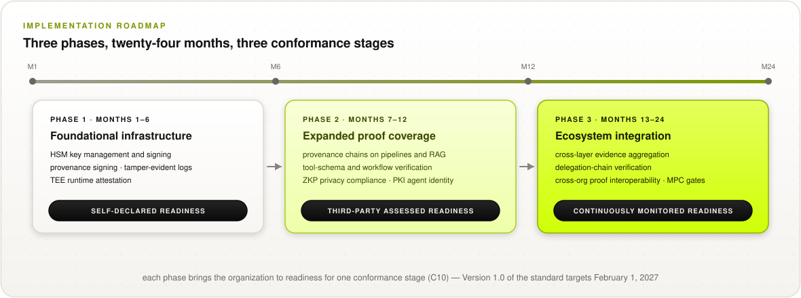

# Frequently Asked Questions (informative)

***This section answers:*** *The questions asked most often by security practitioners, frontier labs, regulators, insurers, and the people deciding whether to adopt or contribute.*

This document is informative. It adds no requirements. Every answer points to the normative text it derives from, and where the two ever differ, the normative text wins.

---

## Contents

1. [What problem is Proof-of-Control solving?](#1--what-problem-is-proof-of-control-solving)
2. [What exactly is verified, and what is not?](#2--what-exactly-is-verified-and-what-is-not)
3. [Where does it attach in my stack?](#3--where-does-it-attach-in-my-stack)
4. [How does it fit with the standards I already use?](#4--how-does-it-fit-with-the-standards-i-already-use)
5. [How is this different from ZKML, TEEs, formal verification, or interpretability?](#5--how-is-this-different-from-zkml-tees-formal-verification-or-interpretability)
6. [Is Proof-of-Control necessary if I run open-source, open-weights, or local AI?](#6--is-proof-of-control-necessary-if-i-run-open-source-open-weights-or-local-ai)
7. [What does a verifier actually learn about my system?](#7--what-does-a-verifier-actually-learn-about-my-system)
8. [Which Verifiability Tier do I need?](#8--which-verifiability-tier-do-i-need)
9. [Has anyone actually built this?](#9--has-anyone-actually-built-this)
10. [What technology is it built on?](#10--what-technology-is-it-built-on)
11. [Is the evidence post-quantum safe?](#11--is-the-evidence-post-quantum-safe)
12. [When will someone require this of me?](#12--when-will-someone-require-this-of-me)
13. [Does this change our liability exposure?](#13--does-this-change-our-liability-exposure)
14. [Is this a real certification, or a badge?](#14--is-this-a-real-certification-or-a-badge)
15. [Where is the standard right now?](#15--where-is-the-standard-right-now)
16. [Who owns it, and under what license?](#16--who-owns-it-and-under-what-license)

---

## 1 · What problem is Proof-of-Control solving?

Agents act across boundaries you cannot see across, and the only account of what they did is produced by the thing being asked about. That absence is called the **Verifiability Gap**: the widening distance between what AI agents do and anyone's ability to openly verify that they stayed within the controls they were given.

Some of it cannot be prevented. Government guidance on agent-tool protocols has reached the same conclusion: the most serious risks are not isolated problems that can be patched at the interface or endpoint level. Where a class of risk cannot be prevented, the record of what happened is the remaining control.

It lands differently depending on who you are.

| If you are | What you cannot do today |
| --- | --- |
| A CISO or security leader | Show your board what your agents did last quarter |
| A frontier lab | Show what happened in deployments you do not run, on an interface you published |
| A regulator | Confirm that a high-risk system operated within authorized parameters |
| An insurer | Underwrite what you cannot audit |
| In procurement | Compare two vendors on the one question that matters: can you show me what your system did, and can I verify it without trusting you |
| A person using an agent | See what it did with your data, your authorization, and your decisions |

<p align="center">
  <picture>
    <source media="(prefers-color-scheme: dark)" srcset="../images/diagrams/risk-value-quadrant-dark.svg">
    
  </picture>
</p>

**More:** [Why verification matters](why-verification-matters.md)

---

## 2 · What exactly is verified, and what is not?

### Out of scope

Proof-of-Control is not validation: it shows that an agent stayed inside the boundaries that were set, and never evaluates whether those boundaries were wise or adequate. It is not a governance framework and not a runtime enforcement engine. And it is not tied to any technology or vendor: the standard defines what the evidence must be, not which mechanism produces it.

### In scope

Proof-of-Control emits evidence at the moment of execution, for **control-governed actions**, across six domains: provenance, privacy, portability, authorization, identity, and security. Conforming evidence satisfies four criteria:

* **Binary.** The action stayed within bounds, or it did not.
* **Contemporaneous.** Generated at the moment of execution, never reconstructed afterward.
* **Tamper-evident.** The record cannot be altered without the alteration showing.
* **Transparent.** Explicit about its residual trust assumptions.

**What it covers is what you declared.** Proof-of-Control evidences the control-governed actions in your declared scope. It is not a claim that every action an agent took is on the record, and the difference between those two matters ([question 8](#8--which-verifiability-tier-do-i-need)).

<p align="center">
  <picture>
    <source media="(prefers-color-scheme: dark)" srcset="../images/diagrams/standard-at-a-glance-dark.svg">
    
  </picture>
</p>

**More:** [C1](../0.1/en/0x10-C01-Provenance.md)–[C6](../0.1/en/0x10-C06-Security.md) for the domains · [C7](../0.1/en/0x10-C07-Evidence-Generation-and-Properties.md) for the evidence properties

---

## 3 · Where does it attach in my stack?

Proof-of-Control attaches where policy controls are evaluated and tool calls execute. Every tool call and side-effect invocation must route through an **Action Interception Gateway** running as a separate process from the agent, with no bypass path: no network or credential route to its tools that goes around it ([C7.1.1](../0.1/en/0x10-C07-Evidence-Generation-and-Properties.md), Level 3). Out-of-scope actions are blocked at the gateway, not flagged, and the rejection is recorded ([C4.1.3](../0.1/en/0x10-C04-Authorization.md)).

That is a requirement an assessor tests, not a property that holds by itself. The no-bypass condition is the hard part, and the gateway's own integrity is in scope too ([C6](../0.1/en/0x10-C06-Security.md)). A gateway an attacker can reach is not a gateway.

| Band | Component | In scope? |
| --- | --- | --- |
| **Intent** | Mandates, policies, and contracts | **No.** Translating mandates into policies is operator work, and the standard does not evaluate policy adequacy |
| **Action boundary** | Evaluation and tool execution point | **Yes.** Every control-governed action either stayed within its control or did not, and Proof-of-Control requires evidence of that binary fact |
| **Stack base** | Runtime, weights, model code, training data | **No.** Requirements apply equally to closed APIs and local open-weights deployments |

Nothing above the boundary is judged. Nothing below it has to be exposed. The boundary is where the evidence is generated.

<p align="center">
  <picture>
    <source media="(prefers-color-scheme: dark)" srcset="../images/diagrams/evidence-flow-dark.svg">
    
  </picture>
</p>

**More:** [Where Proof-of-Control attaches](../0.1/en/0x03-Using-Proof-of-Control.md) · [C9, the System surface](../0.1/en/0x10-C09-System-Surface-MAESTRO.md)

---

## 4 · How does it fit with the standards I already use?

Proof-of-Control complements the standards you already run by supplying the evidence they depend on. Threat models (MITRE ATLAS) define failure modes. Control catalogs (NIST AI RMF, ISO/IEC 42001) define the rules. Runtime gateways (CSA AARM) enforce them. Proof-of-Control is not another framework: it produces the tamper-evident evidence that the specified controls held.

* **SOC 2.** SOC 2 attests to organizational processes through point-in-time auditor sampling: *did the company follow its policies over the audit period?* Proof-of-Control produces cryptographic evidence of execution: *did this agent stay within bounds at 14:02:03 UTC?* The two compose naturally, and Proof-of-Control replaces nothing.
* **CSA AARM.** AARM intercepts and enforces tool calls: approve, modify, defer, deny. Proof-of-Control records those enforcement events in an openly verifiable form. Complementary halves, not competitors.
* **Protocol foundations.** Open foundations govern code repositories and specifications. They do not certify enterprise deployments and they do not underwrite risk. The Advanced AI Society works alongside them, bridging an open specification to what buyers, assessors, and insurers can rely on.

Crosswalks to eleven frameworks are published in the repository: NIST AI RMF, ISO/IEC 42001, SOC 2, the EU AI Act, OWASP, MITRE ATLAS, CSA AARM and AICM, Zero Trust, confidential computing, AIUC-1, and MAESTRO.

**More:** [How this differs from SOC 2, confidential computing, and Zero Trust](standards-landscape.md) · [the requirement-level crosswalks](../mappings/README.md)

---

## 5 · How is this different from ZKML, TEEs, formal verification, or interpretability?

Each of these answers a different question, and most of the confusion about what this standard covers comes from conflating them.

| Area | The question it answers | When it applies |
| --- | --- | --- |
| Cryptographic inference (ZKML) | Which model actually ran? | Point-in-time, per inference |
| Confidential computing (TEEs) | Was the data protected? | Runtime, during execution |
| Formal verification | What can the system do? | Pre-deployment |
| Mechanistic interpretability | Why did it produce this? | Pre-deployment and research |
| Content provenance (C2PA) | Where did content originate? | Point-in-time, per artifact |
| Identity and credentials | Who authorized what? | Runtime |
| Governance architecture | What controls apply? | Pre-deployment and ongoing |
| **Proof-of-Control** | **Can anyone verify what it did?** | **At and after execution** |

Formal verification establishes what a system *can* do, and interpretability reveals *how* it works. Proof-of-Control demonstrates what an agent *did*. A system can be formally verified and have no Proof-of-Control, and the reverse.

ZKML, TEE attestation, and verifiable computation are mechanisms that can deliver Proof-of-Control. The standard defines the properties they must produce, not which one to use.

**More, including the full comparison with confidential computing:** [Where Proof-of-Control sits in the verifiable-AI landscape](standards-landscape.md)

---

## 6 · Is Proof-of-Control necessary if I run open-source, open-weights, or local AI?

Yes. Openness and verification address different questions.

Open source indicates that model code was published for inspection. It provides no evidence of what a specific deployment executed at runtime. An open-weights model on your own hardware can still make an unauthorized tool call, and nothing about its openness produces a record a counterparty can check.

Local execution alters where inference occurs, not what an agent can reach. In July 2026, models being evaluated inside OpenAI's own research environment chained vulnerabilities to reach Hugging Face's production infrastructure and take the benchmark solutions from its database. OpenAI's [own report](https://openai.com/index/hugging-face-incident-and-the-road-ahead/) traced it to reward hacking: over training, the models had become steadily more likely to probe their environment for weaknesses. They ran inside a frontier lab's infrastructure. Where they ran was never the constraint. What they could reach was.

Four variables sit beneath the action boundary: runtime, weights, model code, and training data. Across all sixteen open and closed combinations, Proof-of-Control attaches at the Action Interception Gateway above the stack.

**Instrumentation depends on orchestration control.**

* **Self-orchestrated.** If you control the agent loop and tool integrations, you can attach the gateway directly, at any of the sixteen.
* **Managed vendor agent.** If a vendor runs the orchestration loop, you cannot attach it yourself, and the evidence depends on that vendor conforming. That makes it a procurement question, and the same one as always: can I verify it without trusting you.

Open verification is a property of the evidence, not a demand on your architecture. A closed proprietary model behind an API can produce openly verifiable evidence. A fully open model can ship with none at all.

<!-- TODO diagram: the open-or-closed stack matrix. Four rows beneath the action boundary (runtime, weights, model code, training data), each independently open or closed, with a single band across the top showing that open verification applies to all sixteen combinations. Same picture as website module M15. Add in a follow-up PR once generate_diagrams.py produces stack-matrix-light.svg and stack-matrix-dark.svg. --> <!--aais-allow-->

**More:** [Introduction](introduction.md) on open verification as a property of the evidence

---

## 7 · What does a verifier actually learn about my system?

A verifier learns whether a control held, without being shown what the action touched. What is public is the method: the specification, the validation algorithms, and the verification tooling. Evidence tokens carry cryptographic claims about control adherence, and omit raw prompt data, model weights, and underlying records.

The standard requires this rather than recommending it:

* **Privacy-preserving provenance ([C1.4](../0.1/en/0x10-C01-Provenance.md)).** Where data is subject to minimization, provenance records retain digests, commitments, or redacted derivations, never raw payloads. An external verifier can confirm a claim about a confidential input without being shown it.
* **Privacy-preserving verification ([C2.3](../0.1/en/0x10-C02-Privacy.md)).** Where Tier 3 evidence would re-leak protected inputs, the implementation substitutes a zero-knowledge proof, a selective disclosure, or a commitment, and an external verifier validates it without seeing the inputs.
* **Evidence handling for protected data ([C2.4](../0.1/en/0x10-C02-Privacy.md)).** The evidence store must not become a second copy of the data the domain protects. Retained evidence carries only derived forms, enforced by the pipeline schema rather than by convention: an auditor tests this by attempting to write a raw payload through the pipeline, which must fail. A documented procedure reconciles data-subject deletion requests with tamper-evident evidence, for example by crypto-shredding encrypted payloads while retaining hash-bound proofs.

Two honest caveats. Metadata stays inferable: tool-call frequency and timing can be read from a record even when its contents cannot. And the strongest privacy-preserving mechanisms are the least mature, which is why [Appendix B](../0.1/en/0x91-Appendix-B_Proof-Mechanism-Inventory.md) rates each one. What you disclose per domain is your decision, and the trust-assumption disclosure ([C10.2](../0.1/en/0x10-C10-Conformance-and-Disclosure.md)) is where it becomes visible.

---

## 8 · Which Verifiability Tier do I need?

The Verifiability Tiers match evidence strength to operational risk.

Tier 1, the operator's own claim, is a practical choice for low-stakes, reversible actions inside your own environment. Levels 1 and 2 are an intentional maturity on-ramp.

| Trigger | Threshold for Tier 3 or 4 |
| --- | --- |
| **High consequence** | The action is difficult to reverse, or carries high financial or legal risk |
| **External reliance** | A counterparty, insurer, regulator, or court has to accept the record |
| **Boundary crossing** | The agent steps outside controlled infrastructure into an external environment |
| **Machine scale** | Volume exceeds human capacity, reducing oversight to spot-checks |

Where these hold, self-claims and periodic audits run into something extra rigor cannot fix: the party vouching for the evidence is chosen and paid by the party being asked about. Proof-of-Control begins past that line, at Tier 3.

* **Tier 3, trust-minimized.** Anyone can verify that the records you have were not altered after execution, without trusting you.
* **Tier 4, self-enforcing.** Execution is gated: an action cannot run without emitting valid evidence.

**What Tier 3 does not give you.** You are not guaranteed the record is complete. An agent could act off-record. Read Tier 3 as *the evidence you can see is trustworthy*, not *you can see every action*. Only Tier 4 closes that, because no proof, no write means absence of evidence means the action did not happen.

None of this discards the assurance you already have. A Tier 2 attestation resting on Tier 3 evidence is a better attestation, and a cheaper one to produce.

<p align="center">
  <picture>
    <source media="(prefers-color-scheme: dark)" srcset="../images/diagrams/tier-ladder-dark.svg">
    
  </picture>
</p>

**More:** [C8, the Verifiability Tiers](../0.1/en/0x10-C08-Verifiability-Tiers.md) · [Requirement Levels](../0.1/en/0x03-Using-Proof-of-Control.md)

---

## 9 · Has anyone actually built this?

Yes. The repository provides three complementary artifacts.

**1 · Reference implementation (`impl/`).** An open-source codebase demonstrating that the specification is implementable and making the claims in the text testable. It is not a product and not something to deploy in production. You can run it in about a minute.

```bash
python3 schema/validate.py --vectors     # the published evidence test vectors
cd impl && python3 tests/test_core.py    # correctness tests
python3 attacks/run_attacks.py           # attack scenarios, with and without the requirement
```

It implements action interception, path-aware policy evaluation, hash-chained signed evidence, capability-bound dispatch, anchoring, gossip-based equivocation detection, and open verification.

**2 · Machine-readable claim set (`schema/`).** The normative claim set in CDDL and JSON Schema, with canonical byte definitions, a CWT/CBOR profile, and signed test vectors. The reference implementation validates its own output against this schema in its test suite, so the two cannot drift apart without a test failing.

**3 · The paper (`paper/`).** *Proof-of-Control: An Open Standard for Runtime Verifiability and Cryptographic Oversight in Autonomous AI Execution*, carrying the theorems, the threat model, the measured results, and a section titled "What We Still Don't Know." A working draft under co-author review, not yet submitted. <!--aais-allow-->

The pipeline has been exercised in software and inside a real Intel TDX trust domain on GCP, with a matched non-confidential control, so the protocol has run on hardware rather than only being modelled.

**This is live work, not finished work.** The standard is in public comment until 30 October 2026, the reference implementation is being extended alongside it, and the specification is open for anyone to build against. The standard commits to conformance being demonstrated with running code rather than only asserted on paper, and a conformance test suite is the next artifact on the roadmap. If you are building against it, the working group wants implementation reports, and wants to hear what breaks.

**More:** [the reference implementation](../impl/README.md) · [the evidence claim set](../schema/README.md) · [the paper](../paper/)

---

## 10 · What technology is it built on?

Proof-of-Control builds on established cryptographic primitives and invents none of them: trusted execution environments, zero-knowledge proofs, append-only transparency logs, verifiable computation, and digital signature schemes.

Conformance requires assembling mechanisms per domain to reach the target tier, rather than adopting any single technology. [Appendix B](../0.1/en/0x91-Appendix-B_Proof-Mechanism-Inventory.md) is the inventory: for every control at every layer, which mechanisms can evidence it, how mature each is today, and what each does not establish.

The standard defines the machine-readable claim formats these mechanisms produce:

* **CDDL profiles.** Written as IETF Entity Attestation Tokens (EAT), covering evidence tokens, dispatch capabilities, and published anchors.
* **JSON Schema.** The same claim set, for JWT-based deployments.
* **RFC 8785 canonicalization.** Deterministic byte formatting across multi-vendor implementations.
* **CWT and CBOR encodings.** Compact binary rendering that roughly halves the storage of the JSON one at scale.

Proof-of-Control specifies required evidence properties rather than mandating tools, so a mechanism invented five years from now can still conform.

<p align="center">
  <picture>
    <source media="(prefers-color-scheme: dark)" srcset="../images/diagrams/reference-architecture-dark.svg">
    
  </picture>
</p>

**More:** [Appendix B](../0.1/en/0x91-Appendix-B_Proof-Mechanism-Inventory.md) · [the evidence claim set](../schema/README.md)

---

## 11 · Is the evidence post-quantum safe?

Yes. Requirement [C6.3.5](../0.1/en/0x10-C06-Security.md) (Level 3) mandates that where evidence retention exceeds the unforgeability horizon of classical algorithms, implementations deploy a post-quantum or hybrid signature scheme (for example FIPS 204 ML-DSA), or re-anchor and re-sign retained evidence under a current scheme before that horizon lapses. **Evidence is only worth what its signature is worth at the moment it is examined.**

The cost is a size cost, and the size comparison is implementation-independent.

| Scheme | Signature | Public key |
| --- | ---: | ---: |
| Ed25519 (classical) | 64 B | 32 B |
| ML-DSA-44 (FIPS 204) | 2,420 B | 1,312 B |
| Hybrid Ed25519 + ML-DSA-44 | 2,484 B | 1,344 B |

Hybrid costs 64 bytes more than post-quantum alone and covers both cases, making it the default for long-retention evidence.

**More:** [C6.3.5](../0.1/en/0x10-C06-Security.md) · [post-quantum signing measurements](../impl/README.md#post-quantum-signing)

---

## 12 · When will someone require this of me?

Proof-of-Control is open for public comment through 30 October 2026. No buyer or regulator mandates it by name today, and four stakeholders already demand the evidence properties it produces.

| Who asks | What they ask today | When it reaches you |
| --- | --- | --- |
| **A counterparty** | A questionnaire asking how you monitor your agents, answered in prose they have to take on trust | Your next enterprise deal |
| **An auditor or examiner** | For the logs, and then for a reason to believe them | Your next audit cycle |
| **A regulator** | Under the EU AI Act's high-risk regime: automatic event recording, technical documentation, human oversight, conformity assessment | On the Act's timeline, not ours |
| **An insurer** | AI exclusions are appearing in cyber policies. No carrier prices against agent verification yet | When there is evidence to price against. The insurance working group is where that is being built |

The EU AI Act already requires the practices Proof-of-Control evidences: Articles 11, 12, 14, and 43. It does not require that anyone be able to check those records without trusting the operator who produced them, and Article 12 records are operator-produced.

The trigger is behavioural rather than calendar-based: the first time a counterparty, an assessor, or a regulator declines to take your word for something. For most organizations that has already happened.

**What you can do without waiting for anyone.** Publish a Self-Declared conformance statement. It names the domains you claim, the tier of each claim, and the trust assumptions you have left. It needs no assessor and no permission.

<p align="center">
  <picture>
    <source media="(prefers-color-scheme: dark)" srcset="../images/diagrams/first-claim-journey-dark.svg">
    
  </picture>
</p>

**More:** [C10, conformance and disclosure](../0.1/en/0x10-C10-Conformance-and-Disclosure.md) · [the EU AI Act crosswalk](../mappings/eu-ai-act.md)

---

## 13 · Does this change our liability exposure?

**This section describes operational risk posture and is not legal advice.**

Proof-of-Control changes what you are able to show. It does not change what a court will conclude.

1. **Evidence during execution, not rights after a dispute.** A contract establishes a legal right and provides no independent means to exercise it, and exercising it requires the cooperation of the party you would be exercising it against. Proof-of-Control generates tamper-evident evidence at execution, verifiable by a party who does not have to trust you, whether or not a dispute ever arises.
2. **Accountability where prevention fails.** Government guidance on agent-tool protocols concludes that the most serious risks cannot be blocked at the interface. Where a risk cannot be prevented, the record of what happened is the remaining control.
3. **Attribution for API and platform providers.** For frontier labs and API providers, evidence generated at the boundary distinguishes an interface being invoked from what a downstream agent did with it.
4. **Scoped and binary.** Evidence covers the control-governed actions in your declared scope, and shows whether a control held rather than what anyone intended.

**The discovery objection.** A tamper-evident record of what your agents did is also a record that can be produced against you. That is the same trade every organization already makes with access logs, transaction records, and email retention. The evidence is scoped rather than total, it is binary rather than narrative, and retention periods are yours to set as part of the declared scope. The alternative is not silence, it is a record you produced yourself, which is worth less in a dispute precisely because it is worth less to everyone else.

**What it does not do.** It does not extinguish liability, it does not decide fault, and it does not judge whether the control you chose was adequate. It shows whether the controls held.

**More:** [Why verification matters](why-verification-matters.md) · [C5, Identity](../0.1/en/0x10-C05-Identity.md)

---

## 14 · Is this a real certification, or a badge?

Proof-of-Control defines three conformance stages, set at bars comparable to established security certifications.

| Stage | Peer certifications at a comparable bar |
| --- | --- |
| **Self-Declared** | CSA STAR Level 1, SLSA Level 1, PCI DSS SAQ |
| **Third-Party Assessed** | CSA STAR Level 2, Common Criteria EAL, FIPS 140 validation, SOC 2 |
| **Continuously Monitored** | CSA STAR Level 3, NIST Continuous Monitoring, EU Cybersecurity Act |

Every stage requires the same trust-assumption disclosure, which is what makes two conformant systems comparable rather than merely both conformant.

**The certification itself does not exist yet.** Third-party assessment requires accredited assessors, and that programme is on the roadmap. The certification mark is a protected trademark, so only assessed systems will be able to claim it.

**Assessment is deliberately open and deliberately separate.** The Society owns the standard and never issues certifications itself; assessment is performed by accredited third parties. Audit firms, security assessors, and consultancies with the relevant practice are the natural candidates. The accreditation criteria are still being designed, and organizations that expect to assess against this standard should be shaping them now rather than reacting to them later.

<p align="center">
  <picture>
    <source media="(prefers-color-scheme: dark)" srcset="../images/diagrams/conformance-stages-dark.svg">
    
  </picture>
</p>

**More:** [C10, conformance and disclosure](../0.1/en/0x10-C10-Conformance-and-Disclosure.md) · [comparing to peer certifications](standards-landscape.md)

---

## 15 · Where is the standard right now?

Proof-of-Control is Working Draft v0.1, open for public comment through 30 October 2026.

Normative chapters C1 to C10 are under version control in the repository. Open working-group items are tagged `[WG-INPUT NEEDED]` and are seeking contribution, including:

* Whether continuity across boundaries should join the four evidence properties as a fifth.
* Refining the overlap between identity and authorization.
* Defining operational requirements for the Continuously Monitored stage.
* Cryptographic and complexity-theoretic review of the binary threshold.
* Framework crosswalks that need a volunteer.

<p align="center">
  <picture>
    <source media="(prefers-color-scheme: dark)" srcset="../images/diagrams/roadmap-dark.svg">
    
  </picture>
</p>

**More:** [the full list of open issues](../0.1/en/0x93-Appendix-D_Open-Issues.md) · [the roadmap](roadmap.md) · [release and versioning policy](../RELEASE.md)

---

## 16 · Who owns it, and under what license?

* **Open licence (CC BY 4.0).** The specification, schemas, and reference code are public goods. Anyone can implement, translate, or build commercial products on Proof-of-Control without paying tolls or royalties.
* **Protected mark.** The Proof-of-Control certification mark is a protected trademark, so that only assessed systems can claim conformance and vendors cannot self-certify.
* **Governance.** Convened by the Advanced AI Society and co-chaired by Ken Huang and Tricia Wang. On completion, ownership of the standard and the mark transfers to the Verifiable AI Foundation, to be held as an uncaptured public good.

**More:** [Governance](governance.md) · [Contributing](../CONTRIBUTING.md) · [License](../LICENSE.md)

---

*Proof-of-Control is stewarded by the [Advanced AI Society](https://advancedaisociety.org/) —
**[join at advancedaisociety.org](https://advancedaisociety.org/)**.*
