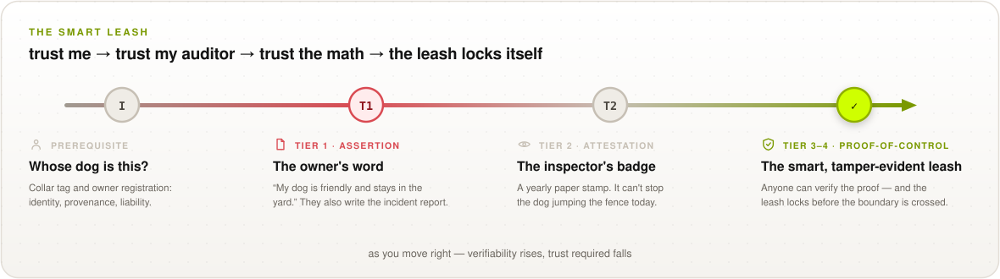

# Proof-of-Control, in One Page: The Smart Leash

*The executive super-overview. No cryptography vocabulary required — one analogy, carried all
the way through the standard. For the full requirements, see the
[chapters](../0.1/en/0x02-Preface.md); for the elevator version, keep reading.*

> **Your AI is making decisions. But are you able to verify what it did?**
> The **Verifiability Gap** is the distance between what autonomous agents *do* and what anyone
> can independently *prove* they did. As agents act at machine speed, governance has to move
> from unverified claims to open, machine-speed proof.

## The Leash Evolves

**trust me → trust my auditor → trust the math → the leash locks itself**

  <picture>
    <source media="(prefers-color-scheme: dark)" srcset="../images/diagrams/smart-leash-dark.svg">
    
  </picture>

## Stage by Stage

### "Whose dog is this?" — the prerequisite

Before a dog enters the park, everyone needs to know *who owns it, who trained it, and who is
liable if it bites.*

**In the standard:** cryptographic agent identity bound to a responsible principal
([C5 Identity](../0.1/en/0x10-C05-Identity.md)), and a verifiable record of which model ran and
where it came from ([C1 Provenance](../0.1/en/0x10-C01-Provenance.md)). Without identity,
attribution is impossible.

### Tier 1 · Assertion — "the owner's word"

*"Don't worry — my dog is friendly and stays in the yard."* You take the owner's word for it. <!--aais-allow-->
And if the dog bites, **the owner writes the incident report.**

**In the standard:** system prompts, safety filters, and operator-held logs. The system executing
the action is the same system writing the record — it can be edited, suppressed, or bypassed.
This is where most deployed agents sit today.

### Tier 2 · Attestation — "the inspector's badge"

A certified inspector visits once a year, checks the collar, stamps a paper badge. **A badge
issued six months ago cannot stop — or prove — anything when the dog jumps the fence today.**

**In the standard:** SOC 2, ISO 42001, third-party audits. Independent, valuable, and still
party-trust-dependent and retrospective. Necessary — not sufficient.

### Tiers 3–4 · Proof-of-Control — "the smart, tamper-evident leash"

Every boundary check is recorded cryptographically as it happens. **Anyone in the park can
check the proof on their phone** (Tier 3) — **and if the dog tries to jump, the leash locks
before the boundary is crossed** (Tier 4).

**In the standard:** the Action Interception Gateway emits tamper-evident, mechanism-generated
evidence for every action ([C7](../0.1/en/0x10-C07-Evidence-Generation-and-Properties.md)),
verifiable by outsiders with published tooling ([C8](../0.1/en/0x10-C08-Verifiability-Tiers.md));
at Tier 4, the system cannot act unless its integrity holds. **This is the binary threshold: a
system has Proof-of-Control here, and only here.**

## One Question, Four Levels of Certainty

| Stage & question | Plain-language analogy | Tier | You must trust | Proof arrives |
| --- | --- | :---: | --- | --- |
| Whose dog is this? | Collar tag & owner registration | *prerequisite* | The registry | At onboarding |
| The owner's claims? | "My dog is trained and friendly" | Tier 1 | The owner | Never |
| The inspector's claim? | A yearly paper badge | Tier 2 | The inspector | Yearly, on paper |
| **Proof-of-Control** | **A smart leash anyone can check, that locks itself** | **Tiers 3–4** | **No one** | **Inline, continuously** |

## Why the Leash Has to Be Smart

* **The dogs bite before the bark.** Agents act at machine speed; retrospective audits arrive
  after the harm. Verification must happen inline, as the action executes
  ([why verification matters](why-verification-matters.md)).
* **Checking must be cheap and binary.** Executing actions costs almost nothing; auditing
  non-deterministic trajectories by hand is the bottleneck. Proof-of-Control makes the check
  mechanical: *"Does your AI have Proof-of-Control?"* is a yes-or-no question.
* **Open beats independent.** "Independent" still means trusting an auditor (Tier 2). "Open"
  means **no one has to be trusted** (Tiers 3–4): anyone can check the proof directly, without
  access to your data.

## Climb the Leash: Questions for Your AI Vendors

Every agent in your estate sits on one of these rungs today. Use it as the acceptance bar for
what "governed" has to mean before an agent gets production authority.

| Rung | Ask your vendor | Verdict |
| :---: | --- | --- |
| Tier 1 | *"Show me your system prompt and guardrails."* If the operator's own logs are your only evidence, you have an assertion — not control. | Trust required: **total** <!--aais-allow--> |
| Tier 2 | *"Show me your SOC 2 / ISO 42001 report."* Good hygiene, but static and retrospective, and it cannot stop a live action. | Trust required: **the auditor** |
| Tiers 3–4 | *"Show me the signed proof for this action — and prove a violation halts execution."* Now you verify the math, not the vendor. **This is the bar.** | Trust required: **none** |

---

*Proof-of-Control is stewarded by the [Advanced AI Society](https://advancedaisociety.org/) —
the industry association for verifiable AI.
**[Adopt the standard → advancedaisociety.org](https://advancedaisociety.org/)***
