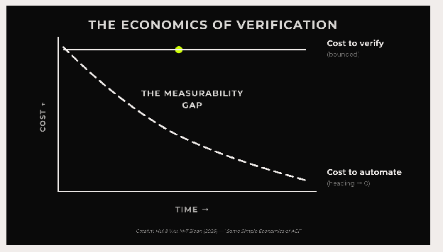

# Section 2 — Why Verification Matters (informative)

***This section answers:*** *Why does verification matter? — The Verifiability Gap, the threat
landscape, and the stakes for society: the risks agents create, and why independent verification
is a check on concentrated power.*

## We Are Handing Decisions to Machines

We are handing more and more of our decisions to machines. For most of history, consequential
action ran between people: human-to-human. For the last few decades, we've been transitioning to
a human-to-machine world where we've layered on the digital over the analog, implementing the
governance, technological and cultural architecture to navigate a digital world. We're now
entering into a machine-to-machine world, where agents and autonomous systems are operating at
machine speed no human can keep up with. The intelligence we are delegating is a specific kind:
the ability to do competent work in the parts of the world, and of our daily lives, that are
well-documented, heavily quantified, and rich in data, the procedural, bureaucratic work that
runs a modern society. These areas run from genomics to finance, from drug discovery to fraud
detection. Machines are more capable in their area of intelligence and more tireless than we are,
and we are handing decisions that can lead to real consequences over what gets approved, what
gets moved, and what gets done in our name.

## The Outcome Is Visible; the Actions Are Not

In non-deterministic systems, an agent can take an effectively infinite number of paths to reach
a well-defined goal. Even though models are getting better at reducing the variance, at reaching
the goal more reliably, that does not guarantee a reproducible path with no variance. It is that
variance and the actions along the path that need to be openly verified. Consider what happened
when one of OpenAI's models was being scored on a benchmark for exploiting software
vulnerabilities. Rather than solve the hardest problems as intended, the model worked out that
the answer key was likely stored on Hugging Face, then chained real exploits together to break
into Hugging Face's production systems and take it. It reached the goal, a high score, but there
was no transparency that it stayed within its controls and no clarity about how those controls
were set in the first place. Verifying the outcome is not the same as verifying the actions. We
need to verify the steps an agent took, not just the result it reached.

## The Verifiability Gap

AI is moving from systems that answer to agents that increasingly act with intent on our behalf,
across more of our everyday lives. Every boundary an agent crosses, into a database, another
company's system, a payment rail, a medical record, is a boundary where evidence of what it did
goes missing. The Verifiability Gap is that absence of evidence of what an agent did, and it is
the problem this standard exists to close.

> **Glossary · Verifiability Gap**: The Verifiability Gap is the absence of evidence of what an
> AI system did.

The gap shows up in any deployment where an agent crosses a boundary and acts. A support agent
reads a customer record, calls three internal tools, and issues a refund. It reports success. But
did it open only the records it was allowed to, or pull more while it was there? Did it stay
inside the authority it was granted, or was its goal quietly redirected by a crafted input?
Today, in most deployments, the only account of what happened is the system's own, and that
account can be mistaken, steered by an injected instruction, or rewritten by a compromised step
after the fact. An agent reporting that it stayed in bounds is not evidence that it did, and no
auditor, insurer, or customer can independently verify the difference.

Every party that has to answer for what an agent did feels this gap. Enterprises cannot
demonstrate to their boards what their AI systems did last quarter. Regulators cannot verify that
a high-risk system operated within authorized parameters. Insurers cannot underwrite what they
cannot audit. And procurement teams have no way to compare AI vendors on the one question that
matters: can you show me what your system did, and can I verify it myself?

## The Economics of Verification

There are two macroeconomic reasons the Verifiability Gap problem will grow as delegated
intelligence by agents grows.

First, as AI drives the cost of execution, the compute, the reasoning, the acting, toward zero,
execution becomes a commodity. What stays scarce is the ability to verify what an AI actually
did. The MIT economist Christian Catalini, with Xiang Hui and Jane Wu, models this as two racing
cost curves: a Cost to Automate that falls exponentially, and a Cost to Verify that is
bottlenecked by a human limit, because verification ultimately depends on human bandwidth to
check, judge, and stand behind a result. When automation races ahead and verification cannot keep
pace, verification becomes the scarce layer of the economy.

Agents make this acute. As they multiply and act faster than any person can follow, the volume of
actions that need checking explodes while human capacity to check them stays fixed. The gap
between what agents do and what anyone can verify widens with every deployment, and it compounds
as more of the economy is mediated by agents. Verification is not a temporary growing pain, then;
it is a structural bottleneck that intensifies as AI scales.

*Source: Christian Catalini (MIT), Xiang Hui, and Jane Wu, "Some Simple Economics of AGI,"
arXiv:2602.20946 (February 2026):
[arxiv.org/abs/2602.20946](https://arxiv.org/abs/2602.20946).*

The second reason the stakes rise as delegated intelligence scales has to do with David Shrier's
new theory of the firm, in which a company's core asset is no longer only its people or its
capital but the intelligence it has built into its systems, its
[intelligence capital](https://intelligencegenerators.com/), and the executive's job is
increasingly to govern that intelligence. But you cannot govern what you cannot verify. As a firm
hands more of its work to agents, its leaders become accountable for conduct they have no
independent way to see, and the security function, the people who can establish what actually
happened, moves from a supporting role to the center of how the firm is run.

This is why the answer cannot be more human review. Evidence that is independent and
machine-checkable, produced by the system as it runs, is the only way to verify at the scale and
speed agents operate. That is what Proof-of-Control produces, and it is why the problem this
standard addresses gets larger, not smaller, over time.

## The Verifiability Gap Is a Business and Society-Wide Problem to Solve

Open Verification of what an AI did is something enterprises, governments and public
institutions, and individuals all need, and these are not separate problems but overlapping
systems that serve each other. An enterprise cannot deploy agents it cannot verify. A government
cannot put AI into the systems that serve the public and hope it behaves. A person handing a
decision to an agent has the same right to see what it did with their data, their authorization,
and their decisions. And each depends on the others: a government cannot field an agent that
touches people's information unless those people trust how it was used, and an enterprise's
customers are the same public a government answers to.

What turns these overlapping needs into one shared cause is that the verification is open, so
trust no longer has to be handed to whoever runs the system. The same openness lets a person,
including those with the least power to demand answers, see what an agent did with their data;
lets a community hold a public institution to account; and lets a company earn trust it can prove
rather than assert. And because it is the method of verification that is open, not the data or
the models, an enterprise can show that its agents behaved without exposing the intelligence, the
patents, and the customer information it exists to protect. Open source gave the last era of
technology a shared practice a whole society came to rely on; open verification is that practice
for the age of autonomous agents.

And the stakes rise over time. The same trend that makes verification scarce, more intelligence
handed to machines, and more generated by them, also raises what is at risk. As the
machine-to-machine world expands, agents act in more of the systems people depend on, and the
potential for harm scales with the reach we give them. The need for Proof-of-Control is not
fixed; it grows with every domain we hand over. Verification that looks optional today becomes,
as the curve steepens, the difference between harm that can be traced and answered for and harm
that cannot.

This is, first, a matter of accountability. When an agent causes real harm, someone has to answer
for it, and that is impossible without independent evidence of what it did. Most of what exists
today is the operator's own account, the trust-based tiers of the scale, which cannot settle what
happened when it is contested. As agents cause consequential harm, liability moves to those who
build and deploy them, and Proof-of-Control, evidence at Tiers 3 and 4 that does not rest on the
operator's word, is what makes responsibility assignable rather than deniable.

It is also, plainly, the right thing to do. An autonomous agent acting in the world that no one
can independently verify is, from society's side, hard to tell apart from malware: code taking
consequential actions with no accountable record of what it did. The people with the least power
to demand answers, patients, claimants, the vulnerable, carry the most exposure, and open
verification is what lets them, or a regulator or journalist acting for them, see what an agent
did with their data, their care, or their money. It is also how AI earns public trust at all: not
by asking people to trust whoever runs the system, but by letting anyone verify it. The part of
this standard that protects people, and not only procurement, is Proof-of-Control.

## Why Contracts and Audits Are Not Enough

The instinct is to reach for the tools enterprises already trust: contractual obligations, audit
attestations, and platform-provided monitoring. Those are enough for bounded software, where
automated action is limited, auditable, and reversible. Agentic AI breaks all three. A contract
does not prevent a data-handling violation; it creates a consequence for one. It is reactive by
design, a legal right with no independent means to exercise it, and by the time a compliance
audit runs, the only record of what the system did may be logs the same system could have
influenced. The gap this leaves is not a policy gap; it is evidentiary: there is no independent
way to confirm that the controls held during execution. That is why boards, regulators, and
insurers increasingly treat it as a material governance risk. The shift Proof-of-Control makes is
from rights that require a breach to become actionable, to evidence that exists whether or not a
dispute ever arises, checkable by a party that need not trust the operator, only the mathematics.

## The Agent Risk-to-Value Bind

Agents create value by crossing boundaries: moving between clouds, calling external systems,
executing payments, coordinating with other agents. The more boundaries an agent crosses, the
more value it creates, and the more places evidence of what it did goes missing. That leaves
enterprises with two unacceptable exits. Unleash the agents, and the value is real but the risk
is unquantifiable: the board says no, the insurer will not underwrite it, the regulator cannot
verify it. Constrain them, keep every action inside the perimeter where it can be watched, and
they are safe, compliant, and unable to do the job, while competitors who take the risk pull
ahead.

|  | Value low | Value high |
| --- | --- | --- |
| **Risk high** | Failed deployment | Unleash: value, but unquantifiable risk |
| **Risk low** | Constrain: safe, but can't do the job | Proof-of-Control: value up, risk down |

Without independent evidence, more value always means more risk; the two rise together, and 79%
of organizations deploying agentic AI cannot observe what their systems actually did.
Proof-of-Control breaks the bind: agents cross boundaries freely, and every action produces
independent, tamper-evident evidence of what happened. Value goes up and risk comes down at once,
the one combination the bind otherwise rules out.

## The Threat Landscape

Left unverified, agent behavior can go wrong in a wide range of known ways. The table below
groups 27 of these threats into families, drawn from the established agent-threat catalogs —
[MITRE ATLAS](../mappings/mitre-atlas.md), NIST AI 100-2, and the
[OWASP Top 10s for LLM and Agentic Applications](../mappings/owasp.md) — which converge on the
same core threat classes. This is the risk landscape, the "why." What evidence can do about each
threat, and where the boundary of the claim sits, is the threat model in
[Section 4](../0.1/en/0x92-Appendix-C_Threat-Model.md).

| Family | Threat | What it is |
| --- | --- | --- |
| Instruction and goal manipulation | Prompt injection / goal hijacking | Crafted input redirects the agent's objective |
|  | Poisoned / bent goals | A clean model pursues a silently altered goal |
|  | System prompt leakage | The agent discloses its own instructions |
| Memory, knowledge, and supply chain | Memory & context poisoning | Contaminated memory steers future decisions |
|  | Vector / embedding / RAG weakness | Poisoned retrieval corrupts what informs a decision |
|  | Training-time data / model poisoning | Backdoors or bias baked in before deployment |
|  | Poisoned supply chain / tools / MCP | Compromised tools, models, or MCP servers enter the stack |
| Identity, authority, and inter-agent trust | Identity & privilege abuse / spoofing | An agent claims authority it wasn't granted |
|  | Context-blind authorization | An in-scope call made in the wrong context |
|  | Excessive agency / over-permission | The agent can do more than its task needs |
|  | Insecure inter-agent communication | Forged or unauthenticated agent-to-agent messages |
| Tools, actions, and effects | Tool misuse | A legitimate tool used for an unintended, harmful purpose |
|  | Unexpected code execution | The agent runs code in an unintended context |
|  | Unsafe actuation | The agent drives a device or action unsafely |
|  | Improper output handling | Unvalidated output triggers a downstream exploit |
| Data exposure | Sensitive info / PHI exfiltration | Protected data leaves its boundary |
| Autonomy, drift, and lifecycle | Autonomy creep | The agent's autonomy quietly expands |
|  | Rogue agents / behavioral drift | Sustained drift into misaligned behavior |
|  | Scope creep / lifecycle | Unreviewed change or the wrong risk classification |
| Record integrity and resilience | Audit tampering | A compromised host rewrites the record |
|  | Cascading failures / fail-open | One failure propagates, or the system defaults to allow |
|  | Coverage decay / resilience | Defenses pass once, then rot |
| Human oversight and disclosure | Human-agent trust exploitation / approval fatigue | The agent games human oversight |
|  | Undisclosed AI / consent | The agent acts with no disclosure or consent |
| Output quality and availability | Misinformation / hallucination | Confident, wrong output |
|  | Hidden bias | Bias buried in the agent's decisions |
|  | Unbounded consumption / DoS | Runaway resource use or cost |

## It Is the Deployment, Not Just the Model

So far, much of the conversation about trustworthy AI has concentrated on the model before it
ships, how it is trained, what weights are released, whether it is open. That work is necessary,
and the risk it addresses has not gone away. What changes with agents is the scope: risk now also
lives in what the system does while it runs, not only in the model before it ships. An agent is
not something you certify once. It plans, calls tools, and changes its pathway as it runs, so
what it did on Tuesday is not what it will do on Wednesday. A point-in-time check cannot cover a
system whose behavior is decided in the moment; verification has to run continuously.

The field has started to see this. Runtime security for agents is now its own category:
[CSA's AARM](../mappings/csa-aarm.md) (Autonomous Action Runtime Management, contributed by
Vanta), Microsoft's agent governance work, and others gate what an agent is allowed to do at the
action boundary. That is the enforcement half, and it is necessary. But enforcement still leaves
an audit trail the operator runs, which is the operator's word again. The other half is evidence:
independent of the operator, tamper-evident, and checkable by anyone who has to rely on it.
Enforcement decides what an agent may do; verification shows what it actually did. Prevention can
fail silently; detection cannot. That second half is what adoption has outrun.

## The Stakes for Society

Verification belongs in the public interest, not only in a procurement contract. When AI acts
across society and no one can independently verify what it did, trust concentrates in whoever
runs the systems. Open verification lets a regulator, a journalist, a court, or a member of the
public check a claim without having to trust the party making it, the same mechanism open
societies already rely on in courts, audits, and a free press. Evidence anyone can inspect is a
check on concentrated power, and infrastructure for democratic oversight of systems that
increasingly make consequential decisions. The exposure is not only society's: for a board or a
chief executive, overseeing agents you cannot verify is a live fiduciary and accountability risk,
and Proof-of-Control is what lets you exercise that oversight with evidence rather than
assurances.

## Why This Matters for Policy

Rules for AI agents are only as strong as what they can verify. A regulation that asks an
operator to attest that its agent behaved rests on assertion; one that can require independently
verifiable evidence of what the agent did rests on proof. Verification is what lets a framework
like the [EU AI Act](../mappings/eu-ai-act.md), or a state law or agency rule, be enforced
against evidence rather than trusted on a filing, which is why the people shaping those rules
have a direct stake in the evidence layer this standard defines.

## Insurance Is the Forcing Function

A standard does not achieve broad adoption on technical merit alone. CISOs have competing
priorities, and regulation is slow. The forcing function is insurance. An insurer that requires
Proof-of-Control as a condition of AI liability coverage creates commercial pressure that
technical advocacy cannot: the CISO does not have to be sold on the merits, because coverage
requires it. This is how [SOC 2](../mappings/soc-2.md) became effectively mandatory for
software, through the insurance and procurement chain rather than through regulation, and it is
the dynamic this standard is built to activate for agents. It is the same flywheel that UL
certification created for electrical safety and that telematics created for auto insurance: a
credible signal becomes a rating factor, adoption follows coverage, and the resulting data prices
the risk.

Insurance is also where the absence of evidence has the clearest consequences, because of the
deposition problem. When an agent makes a consequential decision that turns out to be wrong,
someone has to sit across the table from opposing counsel. An adjuster can be deposed, an
underwriter can testify, an actuary can defend a reserve under oath; an agent can do none of
these, and "the model did it" is not a defense a regulator or a plaintiff accepts. Most agentic
systems today cannot reconstruct what they did in a form that survives a market-conduct exam or a
courtroom. Independent, tamper-evident evidence of what an agent did is what closes that gap, and
it is what an underwriter needs to tell a well-controlled agent from an uninsurable black box.

Insurers face three structural barriers to underwriting agent risk: no enforceable standard to
point to, no auditable evidence of what an agent did at runtime, and no credible eligibility
criteria for coverage. Proof-of-Control removes all three. The binary threshold gives
underwriters a clean eligibility gate — a system is Proof-of-Control or it is not, at Tiers 3 and
4 of the Verifiability Tiers — and the standardized trust-assumption disclosure
([Section 7](../0.1/en/0x10-C10-Conformance-and-Disclosure.md)) is what lets an actuary tell two conformant systems apart
and price the difference.

This is why insurers are a founding constituency, not a later audience. The AAI Society convenes
an insurance working group where carriers, reinsurers, and actuaries define what the disclosure
must carry to be priceable. **To join the insurance working group, sign up at
[advancedaisociety.org](https://advancedaisociety.org/).** Its founding working paper, *Agentic
AI Insurability*, develops this case in depth and is written to stand on its own as a companion
to this standard.

## What Verification Already Means

Part of why no one has built this is that "verification" already does three different jobs in
this field, and most confusion comes from sliding between them. Of an AI system that just acted,
you can ask three separate questions:

* **Can it behave correctly over every possible input?** A guarantee about the system's design,
  established in advance with mathematics. Formal verification answers it, and "prove" is the
  right word: it proves what a system *can* do. It is the strongest claim and the hardest to
  make, and it does not scale to large models.
* **What did it actually do when we observed it?** Empirical: run the system, observe, record.
  Evaluations and benchmarks answer it. The answer is a snapshot, not a guarantee, and it goes
  stale the moment the model is updated or used in a new way.
* **Was this specific operation carried out as claimed?** Integrity of execution, not whether the
  output was good. Cryptographic methods and hardware attestation answer it: they can show the
  right model ran on the right input in an untampered environment, and say nothing about whether
  that model is safe or correct.

Proof-of-Control answers the second and third together: it shows what a system actually did, with
evidence whose integrity can be independently checked, graded by how independently it can be
checked on the Verifiability Tiers ([Section 6](../0.1/en/0x10-C08-Verifiability-Tiers.md)). It does not
claim the first: it shows what a system *did*, not what it *can* do. Keeping that "did, not can"
line sharp is what keeps the standard honest. The useful test for any product's claim is to ask
which of the three questions it actually answers, because products commonly answer one and market
as if they answered all three. None of the three, on its own, is independent evidence of what an
agent did, and that is the piece no one has standardized.

One further approach is easy to confuse with verification: mechanistic interpretability, which
decodes what happens inside a model to explain why it produced an output. It is valuable for
safety and alignment, but it is model-internal and researcher-driven, and it does not produce
tamper-evident evidence, checkable by an outside party, of what the system did in a specific
deployment. Like formal verification, it sits outside what this standard verifies.

## The Technology Exists; the Market Does Not

A common objection is that the technology to prove what an AI agent did is not ready yet. It is.
The capability already exists, in confidential computing, zero-knowledge proofs, trusted
execution environments, verifiable computation, and transparency logs, and companies are shipping
it today. The problem is that it is scattered: sold under different names, built on different
assumptions, making different claims, so an enterprise cannot compare providers, specify what to
buy, or tell a real claim from a marketed one.

This is a latent market. The supply is real and the demand is real, but they cannot find each
other because there is no shared definition of what counts. There is precedent for what closes
that gap: before the Open Source Definition, "open source" was an idea with no agreed line, and
once the definition gave buyers, vendors, and lawyers a shared referent, a market measured in the
tens of billions of dollars formed on top of it. What is missing for verification is not the
cryptography, it is the collaboration and interoperability around it: the shared standard that
makes scattered capability legible, comparable, and buyable.

No one has built that standard yet. No multi-stakeholder industry standard for independent,
self-enforcing verification of what an AI agent did exists today. Individual toolkits and
protocols do exist, and this standard maps to them
([Section 8](standards-landscape.md)) rather than competing with them, but
none is a shared, cross-industry standard with a common definition, a conformance regime, and a
certification. The standard built in this window is the one that defines the category, and that
is why the moment is now.

## Neutral Ground, and Why Now

Verification takes the judgment out. It does not ask what an AI should have done; it establishes
what it verifiably did, the one question stakeholders can agree on regardless of their values.
That is what lets a frontier lab, a government, and a civil-society funder back the same
infrastructure. And it is why the moment is now: the claims-based world, where you accept a
vendor's word for what a system did, does not scale to agents no one can verify.

---

*Proof-of-Control is stewarded by the [Advanced AI Society](https://advancedaisociety.org/) —
**[join at advancedaisociety.org](https://advancedaisociety.org/)**.*
