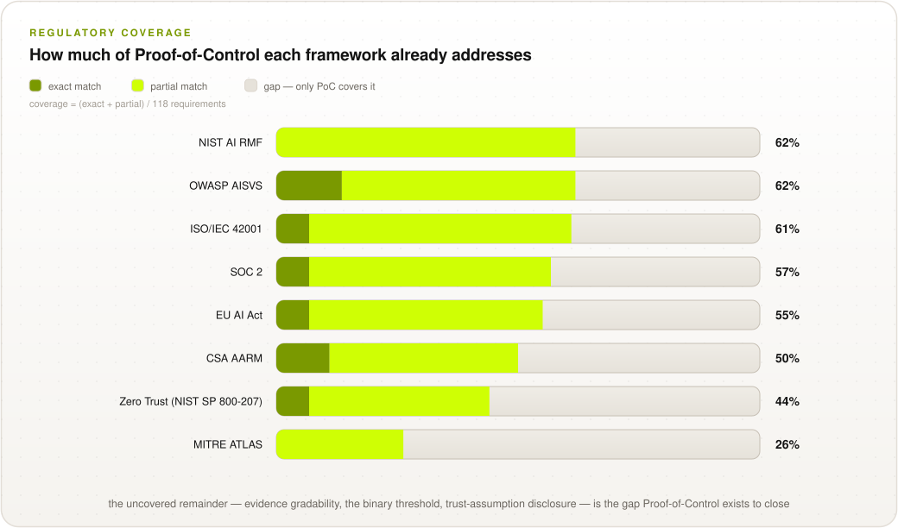

# Framework Mappings

Proof-of-Control cross-references existing standards and frameworks rather than replacing them:
it is the evidence layer that sits alongside them. This directory holds the mapping in two
complementary forms, following the reproducible coverage methodology established by
[HAARF](https://github.com/Task-force-for-AI-agents-in-Healthcare/haarf):

1. **Quantitative coverage mapping** — every one of the 111 PoC requirements coded against each
   external framework as Exact Match / Partial Match / No Match, with reproducible coverage
   percentages.
2. **Qualitative crosswalks** — one narrative document per framework explaining the
   relationship, the complementary halves, and the tier-placement caveats.

## How the Mapping Works

| File | What it is |
| --- | --- |
| [`rubric.md`](rubric.md) | The EM / PM / NM match-type definitions, coding instructions, and the coverage formula |
| [`coding_sheet.csv`](coding_sheet.csv) | Row-level coding: 111 requirements × 8 frameworks = 888 coded rows with rationales |
| [`compute_coverage.py`](compute_coverage.py) | Validates the sheet and reproduces the coverage percentages and the chart below |
| [`corpus/README.md`](corpus/README.md) | Provenance of the external framework documents (title, version, access URL) |

```bash
python3 mappings/compute_coverage.py          # reproduce the numbers
python3 mappings/compute_coverage.py --svg    # regenerate the coverage chart
```

## Coverage Results

> **[WG-INPUT NEEDED] — draft seed coding** (single coder, section-granularity, unvalidated;
> see [rubric.md](rubric.md#coding-status)). Numbers will move as the working group ratifies
> row-level codings.

<p align="center">
  <picture>
    <source media="(prefers-color-scheme: dark)" srcset="../images/diagrams/mapping-coverage-dark.svg">
    
  </picture>
</p>

Each of the 111 requirements is coded against each framework with one of three **match types**
(defined in the [rubric](rubric.md)):

* **EM · Exact Match** — the framework has a clause equivalent in scope and intent.
* **PM · Partial Match** — the framework covers the same topic, but not at the same depth —
  most often because it requires the *control* without requiring operator-independent
  *evidence* that the control held.
* **NM · No Match** — the framework has no analogous provision.

**Coverage = (EM + PM) ÷ 111.** Only exact and partial matches count toward coverage; the NM
column is the gap only Proof-of-Control fills.

| Framework | Exact (EM) | Partial (PM) | None (NM) | Coverage | Qualitative crosswalk |
| --- | :---: | :---: | :---: | :---: | --- |
| NIST AI RMF | 0 | 71 | 40 | **64%** | [nist-ai-rmf.md](nist-ai-rmf.md) |
| ISO/IEC 42001 | 8 | 60 | 43 | **61%** | [iso-iec-42001.md](iso-iec-42001.md) |
| OWASP AISVS | 16 | 51 | 44 | **60%** | [owasp.md](owasp.md) |
| EU AI Act | 8 | 55 | 48 | **57%** | [eu-ai-act.md](eu-ai-act.md) |
| SOC 2 | 8 | 55 | 48 | **57%** | [soc-2.md](soc-2.md) |
| CSA AARM | 11 | 44 | 56 | **50%** | [csa-aarm.md](csa-aarm.md) |
| Zero Trust (NIST SP 800-207) | 8 | 41 | 62 | **44%** | [zero-trust.md](zero-trust.md) |
| MITRE ATLAS | 0 | 30 | 81 | **27%** | [mitre-atlas.md](mitre-atlas.md) |

**Reading the numbers.** Coverage measures how much of *Proof-of-Control* each framework
already addresses — not the reverse, and not framework quality. Two patterns matter:

* **The PM band is wide and the EM band is thin.** Existing frameworks require most of the
  *controls* PoC verifies, but almost never require *operator-independent, mechanism-generated
  evidence* that the controls held. That is the exact gap between Tier 2 and Tier 3 — the
  binary threshold.
* **The NM gap concentrates in C7/C8/C10.** No coded framework grades evidence by how
  independently it can be verified (C8), requires trust-assumption disclosure (C7.4/C10.2), or
  reaches self-enforcing execution (C8.3). The NM gap is, by design, the standard's reason to
  exist.

## Qualitative Crosswalks

| Framework | Type | Relationship to Proof-of-Control | Crosswalk |
| --- | --- | --- | --- |
| MAESTRO (CSA) | Agent threat-modeling framework | Adopted as the System surface (Axis 2) — an axis of the standard, not a coverage target | [maestro.md](maestro.md) |
| CSA AARM | Runtime enforcement standard | Complementary half: AARM enforces, PoC evidences | [csa-aarm.md](csa-aarm.md) |
| CSA AI Controls Matrix (AICM) | Control catalog | Crosswalk maintained separately by WG decision | [csa-aicm.md](csa-aicm.md) |
| OWASP (Agentic Top 10, LLM Top 10, AIVSS, AISVS) | Threat catalogs & verification standard | Threat source for the PoC threat model; Security-domain alignment target | [owasp.md](owasp.md) |
| MITRE ATLAS | Adversarial threat catalog | Threat source for the PoC threat model | [mitre-atlas.md](mitre-atlas.md) |
| NIST AI RMF (& AI 100-2) | Risk-governance framework | PoC produces the evidence that makes its requirements checkable | [nist-ai-rmf.md](nist-ai-rmf.md) |
| ISO/IEC 42001 | AI management system standard | Complementary; supplies the V&V vocabulary PoC uses | [iso-iec-42001.md](iso-iec-42001.md) |
| SOC 2 | Organizational attestation | PoC is SOC-2-grade in role, with a cryptographic stage SOC 2 never had | [soc-2.md](soc-2.md) |
| EU AI Act | Regulation | PoC evidence lets the Act be enforced against evidence, not filings | [eu-ai-act.md](eu-ai-act.md) |
| Zero Trust (NIST SP 800-207; Anthropic Zero Trust for AI Agents) | Security architecture / vendor framework | Zero Trust enforces at runtime; PoC shows independently that control held | [zero-trust.md](zero-trust.md) |
| Confidential Computing (TEEs) | Mechanism | One valid mechanism for delivering PoC, not the property itself | [confidential-computing.md](confidential-computing.md) |
| AIUC-1 | AI audit / certification framework | Portability-domain alignment target (cross-platform auditing) | [aiuc-1.md](aiuc-1.md) |

## The By-Domain Mapping (working view)

For each domain of verification, the architectural mechanisms that produce the evidence and the
external standards to align with — classified by domain (proposed by Jim Schwoebel of Quome) and
being developed as a graph (led by David Thomson of Tesseract):

| Domain | Source architectural mechanism | Targets for external alignment |
| --- | --- | --- |
| Provenance | *working group to complete* | *to complete* |
| Privacy | TEEs, local-only inference enclaves | HIPAA / HAARF data governance, [EU AI Act](eu-ai-act.md) conformance |
| Portability | Agent Resource Discovery Spec, Open Handshakes | [AIUC-1](aiuc-1.md) cross-platform auditing |
| Authorization | Cryptographic hash chains, ZKML | [SOC 2 Type II](soc-2.md) (proving runtime execution matched policy) |
| Identity | W3C CID, WIMSE / IETF AI-Auth | HAARF audit logs, CSA Vanta Agent Trust Controls |
| Security | [OWASP AIVSS](owasp.md), SSF / CAEP | [OWASP Top 10 for Agentic AI](owasp.md), [NIST AI RMF](nist-ai-rmf.md) |

## Contributing

* **Validate the seed coding:** the highest-value contribution right now. Pick a framework,
  obtain the corpus document ([corpus/README.md](corpus/README.md)), re-code the rows in
  [`coding_sheet.csv`](coding_sheet.csv) per the [rubric](rubric.md), and open a PR with your
  `coder_id`. Second coders enable inter-coder agreement statistics.
* **Extend the corpus:** code a pending framework (AIUC-1, CSA AICM, OWASP Agentic Top 10,
  IEEE 7000-series, HAARF) end-to-end.
* **Improve a crosswalk:** several qualitative crosswalks are marked
  **[WG-INPUT NEEDED] — volunteer needed**.

To take any of these on, join a working group:
**[advancedaisociety.org](https://advancedaisociety.org/)**.

---

*Proof-of-Control is stewarded by the [Advanced AI Society](https://advancedaisociety.org/) —
**[join at advancedaisociety.org](https://advancedaisociety.org/)**.*
